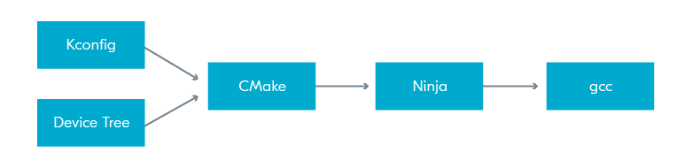
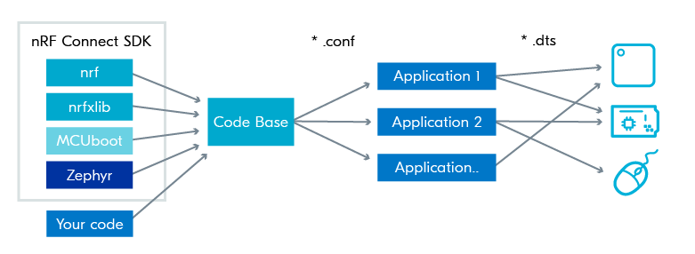
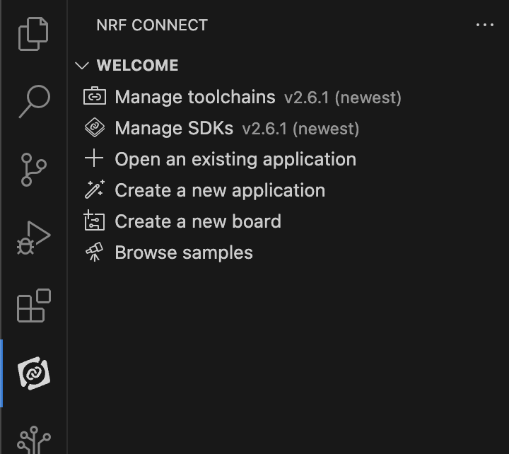
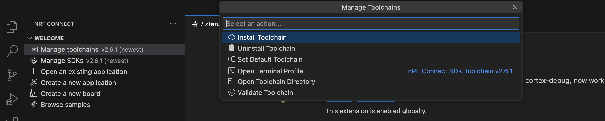
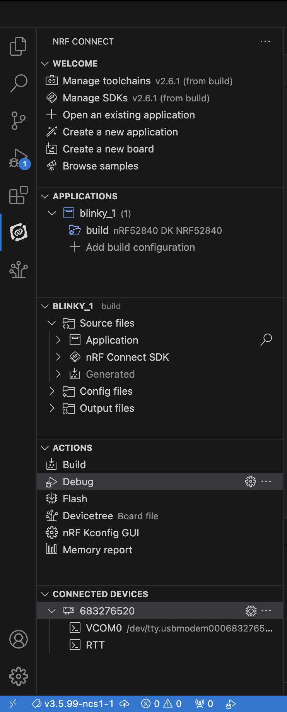
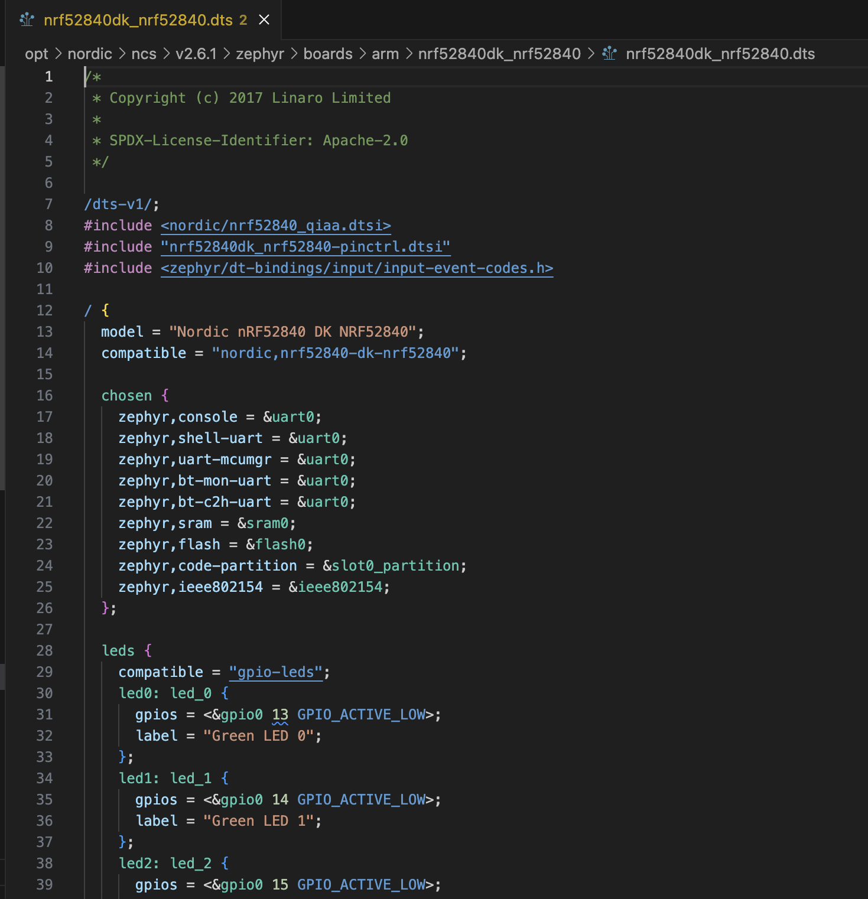

ในบทความนี้ จะบันทึกบทเรียน nRF Connect SDK Fundamentals ของ [Nordic Dev Academy](https://academy.nordicsemi.com) เพื่อเรียนรู้การพัฒนา Firmware บน nRF Connect SDK กับบอร์ดของ Nordic รุ่น nRF52840-DK เพราะว่ามีบอร์ดนี้อยู่แล้ว (ไม่รู้ว่ามีได้ยังไง?)

ในการพัฒนา Firmware ของ Nordic จะพัฒนาบนพื้นฐานของ RTOS (real-time operating system) ที่เรียกว่า Zephyr RTOS ซึ่งเป็น open-source และออกแบบมาสำหรับระบบ embedded โดยเฉพาะ รองรับ MCU รุ่นอื่นๆ อีกมากมาย

ตามหลักสูตร สิ่งที่จะได้ตลอดการเรียนรู้นี้คือ
- ข้อมูลพื้นฐาน วิธีการใช้ และตั้งค่า nRF Connect SDK
- การใช้งาน devicetree
- การตั้งค่า software modules ด้วย Kconfig
- ฝึกการใช้งาน hardware peripherals อย่าง UART/SPI/I2C
- รู้จักระบบ Zephyr RTOS เช่น การจัดการ thread, การสื่อสารระหว่าง task เป็นต้น

เดี๋ยวเราจะมาเรียนรู้การติดตั้งและการตั้งค่าเริ่มต้นของ nRF Connect SDK กันก่อน เพราะส่วนที่มักจะมีปัญหา และใช้เวลาในการแก้นานมากๆ โดยเฉพาะกับมือใหม่ๆ (อย่างเรา) คือการ setup พวก library path และการติดตั้งเครื่องมือต่างๆ ให้มันสามารถ build และ flash ลง MCU ได้จนไปถึงการ debug แบบทีละ instruction ซึ่งโชคดีมากๆ ที่ Nordic นั้นทำระบบติดตั้งมาไว้ให้พร้อมแล้ว


## Prerequisites

ก่อนอ่านบทความนี้ ควรจะมีพื้นฐาน และอุปกรณ์ดังต่อไปนี้

- การเขียนภาษา C ระดับ Basic (hello world ได้ เข้าใจ pointer พอประมาณ)
- เคยเขียน firmware หรือ ระบบ embedded systems มาบ้าง

### Hardware Requirements

- Nordic Development Kit ซัก 1 บอร์ด (nRF7002 DK, nRF5340 DK, nRF52840 DK, nRF52833 DK, nRF52 DK, nRF9160 DK, nRF9161 DK , Thingy:53, หรือ Thingy:91)
- Micro-USB 2.0 Data cable

### System Requirements

- Computer ระบบปฏิบัติการอะไรก็ได้ (Windows, MacOS, Linux) ขอมี USB-A สำหรับเสียบบอร์ดก็พอ

### Software requirements​

เดี๋ยวจะพาลงใน Lesson 1 ซึ่งจะมี 3 ตัวดังนี้

- nRF Connect for Desktop
- nRF Command Line Tools
- Visual Studio Code

## Lesson 1 – nRF Connect SDK Introduction

ใบบทแรกจะพามาทำความรู้จักกับตัว SDK กันก่อน รวมไปถึงการติดตั้ง และการ flash firmware ลงใน nRF52840-DK Board

### nRF Connect SDK คืออะไร? โครงสร้างเป็นแบบไหน?

nRF Connect SDK (nRF Connect Software Development Kit) คือ SDK ที่ถูกพัฒนาโดยบริษัท Nordic Semiconductor เพื่อใช้สำหรับพัฒนา application ของชิปบริษัทตัวเอง โดยเฉพาะกับ low-power wireless application

ด้วย SDK นี้จึงทำให้เราสามารถทำระบบซับซ้อนๆ ได้ง่ายขึ้น รองรับกับพวกอุปกรณ์ทั้งหลายอย่าง Bluetooth, Wi-Fi และรวมไปถึงพวก middleware อย่าง CoAP, MQTT ได้สะดวกขึ้นด้วย ซึ่งถ้าจะต้องเขียนเองตั้งแต่ต้นก็คงจะไม่รอด 😂


nRF Connect SDK จะมีการวางโครงสร้างของ library ต่างๆ เป็นชั้นๆ โดย Zephyr และ hardware peripheral เป็นฐาน และมี Middleware เป็นตัวกลางเชื่อมกับโค้ดที่เราจะเขียน

การใช้งาน nRF Connect SDK ไม่จำเป็นต้องดาวโหลดแยกเฉพาะบอร์ด หรือเฉพาะเวอร์ชัน สามารถใช้ SDK โค้ดชุดเดียวกันกับทุกๆ บอร์ดได้เลย และ source code เองก็เปิด public บน Github ให้ download ได้เลย

nRF Connect SDK เกิดจากการรวมของ 4 repository หลักนั่นคือ
 - nrf: Applications, samples, connectivity protocols (Nordic)
 - nrfxlib: Common libraries and stacks (Nordic)
 - Zephyr: RTOS & Board configurations (open source)
 - MCUBoot: Secure Bootloader (open source)

และ repository อื่นๆที่เข้ามาช่วยเสริมการพัฒนาระบบให้เราทำงานได้ง่ายและสะดวกขึ้น

ทางด้าน Toolchains ที่ใช้ในการพัฒนาก็ออกแบบมาได้เป็นอย่างดีไม่แพ้กัน มีการใช้ Kconfig เข้ามากำหนดและตั้งค่าทั้งระบบ เช่นการเลือกใช้ protocol หรือ library ภายใน application และใช้ devicetree สำหรับจัดการกับ hardware จากนั้น CMark จะนำข้อมูลจากทั้ง 2 อย่างมาสร้างไฟล์ build ขึ้นมาและทำการ build ผ่าน ninja โดยใช้ GCC complier ทำการ build ออกมาเป็นไฟล์ที่พร้อมาำหรับการลงระบบ



ด้วยความที่ source code ภาษา C ของเราจะถูกกำหนดและตั้งค่า application ผ่าน Kconfig แยกกับการจัดการ hardware ด้วย devicetree ทำให้ง่ายต่อการเขียน application เดียวกันลงบนหลาย hardware ด้วยการเปลี่ยน config เพียงเล็กน้อย มันจะทำให้ง่ายต่อการเปลี่ยนผ่านและการดูแลทั้งตัวอุปกรณ์, source code และ application



โครงสร้างของ nRF Connect SDK หลักๆ ก็จะมีประมาณนี้ ไม่เข้าใจก็ไม่เป็นไร ดูส่วนต่างๆ ผ่านๆ ไปก่อน เดี๋ยวตอนที่ลงมือปฏิบัติจริงจะมีการตั้งค่า toolchains พวกนี้และจะช่วยให้เข้าใจมากขึ้น 😁

### การติดตั้ง nRF Connect SDK

Nordic ให้หลากหลายวิธีในการติดตั้ง SDK มา ซึ่งสามารถเลือกได้ตามสะดวก แต่ในที่นี้จะขอเลือกวิธีที่ทาง Nordic เองได้แนะนำเอาไว้ นั่นคือการใช้ VSCode กับ Extensions สำหรับการพัฒนา โดยสามารถดูรายละเอียดได้จาก [Link](https://docs.nordicsemi.com/bundle/ncs-latest/page/nrf/installation.html) หรือจะทำตามด้านล่างเลยก็ได้

#### 1. การติดตั้ง nRF Connect SDK และ VS Code

##### 1.1 การติดตั้ง nRF Command Line Tools

ตัวแรกที่เราจะติดตั้งก็คือ nRF Command Line Tools เพื่อใช้สำหรับการ build, program และ debug ชิปของ Nordic โดยสามารถ download ได้ที่ official page ด้านล่าง เลือกระบบปฏิบัติการที่ใช้ และติดตั้งได้เลย

[nRF Command Line Tools](https://www.nordicsemi.com/Products/Development-tools/nRF-Command-Line-Tools/Download)

<span class="red">
*** บน Linux และ MacOS นั้น จะต้องกดติดตั้ง SEGGER J-Link Software เอง ส่วน Windows จะติดตั้งให้อัตโนมัติ
</span>

##### 1.2 การติดตั้ง VS Code และ nRF Connect Extension Pack

ตัว VS Code หรือ Visual Studio Code เป็น IDE สำหรับการเขียนโค้ด สามารถ download ได้จาก official page ของ visual studio ติดตั้งเหมือนโปรแกรมทั่วๆ ไป

[Visual Studio Code](https://code.visualstudio.com/Download)

ส่วนของ extensions นั้นจะมีอยู่ 8 extensions ที่จะต้องลง แต่ทาง Nordic เองก็รวบรวมเป็น Extension Pack ไว้ให้แล้ว ซึ่งเราจะกดติดตั้งแค่ 2 extensions ได้แก่

  - [nRF Connect Extension Pack](https://marketplace.visualstudio.com/items?itemName=nordic-semiconductor.nrf-connect-extension-pack): รวม nRF extension ทั้งหมดที่จำเป็นต้องใช้

  - [Cortex-Debug](https://marketplace.visualstudio.com/items?itemName=marus25.cortex-debug) สำหรับ debug ใช้ดูพวก memory หรือ register

โดยหลังจากที่ติดตั้ง VS Code เสร็จสิ้น ก็สามารถกดปุ่ม Install ผ่านหน้าเว็บได้เลย หลังจากนั้น ก็กดปุ่ม Install จากใน VSCode อีกครั้งเพื่อติดตั้งหรือจะใช้วิธีการค้นหาจากชื่อใน VS Code ก็ตามสะดวก


สรุป Extensions ที่ติดตั้งไปคือ

  - **nRF Connect for VS Code**: เป็น interface ติดต่อกับพวก build system และ nRF Connect SDK รวมไปถึงการจัดการพวก toolchain และ SDK version ด้วย
  - **nRF DeviceTree**: เพื่อให้ VSCode รองรับกับภาษาและไฟล์ของ Devicetree
  - **nRF Kconfig**: เพื่อให้ VSCode รองรับกับภาษาและไฟล์ของ Kconfig
  - **nRF Terminal**: สำหรับการใช้งาน serial and RTT
  - **C/C++ from Microsoft**: เพื่อให้ VSCode รองรับภาษา C/C++ รวมไปถึงการตัวช่วยเขียนให้เขียนสะดวกขึ้น
  - **CMake**: เพื่อให้ VSCode รองรับการใช้ CMake
  - **GNU Linker Map Files**: เพื่อให้ VSCode รองรับไฟล์ Linker map

หลังจากติดตั้งก็จะมีไอคอนขึ้นทางซ้าย ดังรูป



##### 1.3 การติดตั้ง Toolchain และ nRF Connect SDK

Toolchain คือโปรแกรมที่เราจะเอามาใช้ร่วมกับ nRF Connect SDK เพื่อทำการ build application ของเราขึ้นมา โดยเราสามารถติดตั้งผ่าน nRF Connect for VS Code ได้เลยโดยการกด `Manage toolchains > Install Toolchain > nRF ConnectSDK Toolchain (version ล่าสุด)` หลังจากนั้นระบบก็จะดาวโหลดให้เอง



และกับ nRF Connect SDK ก็ใช้ท่าเดียวกับการลง Toolchain คือ `Manage SDKs > Install SDK > (stable version ล่าสุด)`
หากไม่มี Manage SDK ให้กด ให้ลองกด `Manage west workspace` ก่อนแล้วเลือก path สำหรับติดตั้ง

#### 2. Build และลอง flash nRF Connect SDK application ลงบอร์ด

หลังจากติดตั้งเสร็จ ก็ต้องแน่ใจว่าเราจะสามารถทำการ build และ flash ลงบนบอร์ดได้ โดยท่าที่ง่ายที่สุดที่จะทดสอบว่า environment สำหรับการพัฒนา nRF52840 DK พร้อมแล้ว ก็คือโปรแกรมไฟกระพริบใน sample application

การทดสอบก็จะมีดังนี้

1. ที่ nRF Connect Extension จะมี Create a new application อยู่ด้านล่าง ให้กด `Create a new application > Copy a sample > Blinky Sample` หลังจากนั้นก็เลือก application path ได้ตามใจชอบ เราก็จะได้ Blinky Sample application ออกมาแล้ว

2. เราจะทำการตั้งค่า build config กันก่อนเพื่อให้สามารถ build firmware ได้ตรงกับบอร์ดที่เราใช้ โดยกดที่ nRF Connect SDK Extension แล้วสังเกตุที่ Applications tab จะมีโปรแกรมของเราอยู่ ให้กด `Add build configuration` จะได้หน้าต่าง config ตามรูปข้างล่าง ให้แก้ให้ตรงตามรูปด้านล่างทั้งหมด แล้ว


หากต้องการรู้ว่าเราตั้งค่าการ build อะไรไปบ้าง สามารถดูได้จากตารางข้างล่างนี้

| number | title                                | value               | description                                              |
| ------ | ------------------------------------ | ------------------- | -------------------------------------------------------- |
| 1      | Board                                | nrf52840dk_nrf52840 | เป็น ID ของ board ที่เราต้องการ flash ดู ID อื่นๆ ได้จาก website |
| 2      | Revision                             | -                   | รุ่นของบอร์ด ดูได้ที่ board ว่าเป็น version ไหน                   |
| 3      | Configuration                        | prj.conf            | การ config board สามารถที่จะปรับเปลี่ยน config ได้จากไฟล์       |
| 4      | Kconfig fragments                    | -                   | เพิ่มไฟล์สำหรับการ config Linux kernel                        |
| 5      | Devicetree Overlay                   | -                   | เพิ่มไฟล์สำหรับการขยาย หรือปรับปรุง Devicetree เดิม               |
| 6      | Extra CMake arguments                | -                   | ส่ง arguments เพิ่มเติมไปยัง build system                     |
| 7      | Build directory name                 | -                   | ชื่อและตำแหน่งของไฟล์ build                                   |
| 8      | Optimization Level                   | Use project default | สำหรับการ optimize การ build                               |
| 9      | Build after generating configuration | check               | หากมีการสร้าง config ใหม่ จะทำการ Build ให้                   |
| 10     | Use sysbuild                         | uncheck             | เปิดการใช้ system build                                    |

สำหรับ Optimization Level ตัวเลือกต่างๆ จะมีดังนี้
 - Optimize for debugging (-Og) เพื่อการ debug ระบบ (default)
 - Optimize for speed(-O2) เพื่อการ build ที่ใช้เวลาน้อย เหมาะกับการทดสอบระบบ
 - Optimize for size (-Os) เพื่อการ build ที่ขนาดเล็กลง เหมาะกับ production

ซึ่งเลือกใช้ default กันไปก่อนนะ

หากทำบุญมาเยอะ ไม่มีอะไรผิดพลาด หลังจากกดปุ่ม Build Configuration ด้านล่าง มันก็จะไปรวมรวบไฟล์ต่างๆ ที่จะต้องใช้มาอยู่ใน build folder โดยไม่มี error เกิดขึ้น และจะมี tool สำหรับอำนวยความสะดวกในการใช้ดังรูปด้านล่าง ซึ่งเราสามารถสั่ง build หรือ flash ได้จากตรงนี้เลย



สามารถ build ผ่าน flash สำเร็จ และ board มีไฟกระพริบที่ LED1 ก็จบพิธีการ setup environment ของ nRF บน VS Code ใน Lession 1 แล้ว

### ข้อมูลเพิ่มเติม

องค์ประกอบสำคัญในการ build คือ `west` ซึ่งเป็น tool ใน nRF Connect SDK/Zephyr `west` จะอยู่เบื้องหลังและคอย support ให้เราอีกหลายอย่าง เช่น จัดการพื้นที่เก็บข้อมูล การสร้างแอปพลิเคชัน และการ flash เราสามารถใช้ `west` โดยตรงได้ผ่าน nRF Connect terminal โดยพิมพ์ `west help` หากอย่างลองศึกษาดูสามารถเข้าไปที่นี่ได้เลย [West (Zephyr’s meta-tool)](https://developer.nordicsemi.com/nRF_Connect_SDK/doc/latest/zephyr/develop/west/index.html)

## Lession 2 - เรียนรู้ Devicetree จากโปรแกรมกดปุ่มและควบคุมไฟ LEDs

ในส่วนของ hardware configuration และการทำงานร่วมกันระหว่าง application กับ hardware มันจะทำผ่านสิ่งที่เรียกว่า driver เดี๋ยวมาดูกันว่าเราจะเขียนกันยังไงผ่านการใช้ของง่ายๆ อย่าง GPIO โดยการทำไฟเปิด/ปิดจากการกดปุ่มกัน

ใน Lession 2 นี้จะทำให้เราอ่านไฟล์ devicetree เป็น และเข้าใจในเรื่องของ devicetree API เพิ่มขึ้น

### Drivetree

การเขียน firmware บน nRF Connect SDK นั้นจะอยู่บนฐานของ zephyr RTOS ซึ่งโดยปกติแล้ว hardware จะถูกตั้งค่าไว้ใน header file (.h หรือ .hh) แต่ nRF Connect SDK ใช้โครงสร้างจาก Zephyr RTOS ที่เรียกว่า devicetree มาช่วยในการตั้งค่า hardware ที่จะใช้งาน

devicetree เป็นโครงสร้างข้อมูลแบบลำดับชั้น (hierarchical data structure) ซึ่งจะตั้งค่า และกำหนดทุกๆอย่างของ hardware ตั้งแต่การตั้งค่า GPIO ของไฟ LED บน SDK Board ไปจนถึง Peripherals address หรือ Register

สามารถดูรายละเอียดของ Drivetree ได้จากเว็บ [Zephyr Project Website](https://developer.nordicsemi.com/nRF_Connect_SDK/doc/latest/zephyr/guides/dts/index.html)

#### Devicetree basic

โครงสร้างของ devicetree ก็จะเหมือนชื่อคือมีโครงสร้างคล้ายต้นไม้ เรียกว่า DTS (**d**evice**t**ree **s**ource)

```dts
/dts-v1/;
/ {
        a-node {
                subnode_label: a-sub-node {
                        foo = <3>;
                };
        };
};
```

ให้ลองมองแต่ละแทบที่ย่นเข้าไปคือ Node ดังนั้นตามตัวอย่างจะเป็นต้นไม้ที่มี 3 node
 - Root node: /
 - a-node: ซึ่งเป็นลูก (child) ของ Root node
 - a-sub-node: ซึ่งเป็นลูก (child) ของ a-node

node ใน devicetree สามารถที่จะมีป้ายกำกับ (labels) ที่เป็นตัวย่อเฉพาะเพื่อใช้ในการอ้างอิงถึง node ในที่อื่นๆ ภายใน devicetree ได้ ตามตัวอย่างคือ node ย่อย (a-sub-node) มีป้ายกำกับชื่อ subnode_label โดยแต่ละ node อาจจะมีหนึ่งหรือหลาย label ก็ได้ หรือจะไม่มีป้ายกำกับเลยก็ยังได้

node ใน devicetree ยังสามารถมีคุณสมบัติ (properties) ซึ่งเป็นคู่ key-value โดย value สามารถที่จะเป็น array, string, byte, number หรือจะผสมกันก็ได้ ในตัวอย่าง a-sub-node มีคุณสมบัติชื่อ foo ซึ่งมีค่าเป็น 3 ขนาด โดยค่าของ foo จะถูกกำหนดภายในวงเล็บ (< และ >) ตามรูปแบบการกำหนดค่าใน int type

node ใน devicetree มี path ที่ตั้งเส้นทางใน devicetree ซึ่งจะเป็น string ที่คั่นด้วยเครื่องหมายทับ (/) เช่นเดียวกับระบบไฟล์ใน Unix โดยเส้นทาง Root node คือเครื่องหมายทับ: / และสำหรับ node อื่นๆ จะถูกสร้างขึ้นโดยการต่อชื่อของ node แม่กับชื่อของ node เองคั่นด้วยเครื่องหมายทับ ตัวอย่างเช่น path เต็มของ a-sub-node คือ /a-node/a-sub-node

#### Devicetree bindings (YAML files)

สำหรับตัว devicetree bindings เราไม่ต้องทำอะไร เพราะมันจะมาพร้อมกับ SDK ในโฟลเดอร์ <install_path>\zephyr\dts\bindings อยู่แล้ว ซึ่งมาจากผู้พัฒนา รวมไปถึง devicetree binding สำหรับอุปกรณ์ของ Nordic Semiconductor หรือ SDK board ก็จะอยู่ในที่เดียวกันนี้ด้วย ในที่นี้ก็มาเรียนรู้กันว่ามันใช้ทำอะไร และจะอ่านมันรู้เรื่องได้ยังไง

Devicetree binding เปรียบเสมือนลายแทงของ hardware เพราะมันคือการกำหนดคุณสมบัติ (property) ที่จะให้ node ใน devicetree เอาไปใช้ เพื่อให้มีความเข้ากันได้กับ hardware ได้อย่างถูกต้อง ซึ่งจะมีคุณสมบัติที่เรียกว่า `compatible` เป็นตัวระบุว่า node นี้เข้ากันได้กับอะไรบ้าง ตัวอย่างเช่น

```yaml
compatible: "nordic,nrf-sample"
properties:
  num-sample:
    type: int
    required: true
```

หมายถึง เรามีคุณสมบัติ "compatible" ชื่อ "nordic,nrf-sample" และมีคุณสมบัติ "num-sample" ซึ่งเป็นจำนวนเต็ม (type: int) และต้องมีการกำหนดคุณสมบัตินี้อยู่เสมอ (required: true)

ตัวอย่างไฟล์ DTS (.dts) ที่ใช้การผูกนี้:

```dst
node0 {
     compatible = "nordic,nrf-sample";
     num-sample = <3>;
};
```

ในไฟล์ DTS นี้ "node0" node มีคุณสมบัติ "compatible" และ "num-sample" ซึ่งต้องเป็นจำนวนเต็ม และถ้าไม่มีคุณสมบัตินี้ก็จะ build ไม่ผ่าน

ซึ่งการเปิดอ่าน devicetree binding ก็จะช่วยบอกใบ้ถึงวิธีการใช้งาน hardware และ board คร่าวๆ ได้ด้วย

#### การใช้ Alias ใน Devicetree

alias เป็นการอ้างอิงถึง node ใน devicetree นั้นๆ และสามารถใช้ alias แทน node นั้นๆ ได้ เปรียบเสมือนการตั้งชื่ออีกชื่อให้กับ node ที่ต้องการ ตามตัวอย่างด้านล่าง


```dts
/ {

        subnode_label: a-sub-node {
                foo = <3>;
        };

        aliases {
                subnode_alias = &subnode_label;
        };
};
```

ตัวอย่างนี้กำหนดให้ a-sub-node ที่ถูกอ้างอิงด้วยป้ายชื่อ subnode_label และมี alias ชื่อ subnode_alias

จุดประสงค์ของการใช้ alias คือช่วยอำนวยความสะดวกในการตั้งชื่อตัวแปรในโค้ด การกำหนดชื่อในไฟล์ dts (เช่น led0 สำหรับ LED ตัวแรกบนบอร์ด) ก็ทำให้โค้ดมีความยืดหยุ่นมากขึ้น หลีกเลี่ยงการเขียนชื่อ node นั้นๆ ลงบนโค้ดได้โดยตรง ทำให้โค้ดลดการผูกโค้ดที่เป็น Logic กับ devicetree ลง เราจึงสามารถเปลี่ยนไปใช้บอร์ดอื่นๆ ได้โดยไม่ต้องแก้โค้ดนั่นเอง

#### การใช้ Devicetree ในภาษา C

การที่จะอ้างอิงถึง devicetree ในโค้ดของเรานั้น จะต้องมีตัวระบุ node ซึ่งเป็น marco ในภาษา C ที่ใช้อ้างถึง node นั้นๆ  ซึ่งก็มีหลากหลายวิธีด้วยกัน แต่วิธีที่พบบ่อย จะเป็นสองวิธีนี้ คือ
 - ใช้ label ผ่าน marco ด้วยด้วยคำสั่ง DT_NODELABEL()
 - ใช้ alias ผ่าน marco ด้วยคำสั่ง DT_ALIAS()

ตัวอย่างเช่น a-sub-node:

```c
DT_NODELABEL(subnode_label)
```

และคุณสมบัติของ devicetree บางอย่าง เราสามารถใช้มาโคร DT_PROP() เพื่อรับค่าเข้าไปในตัวแปรได้ ตัวอย่างเช่น การรับค่าที่กำหนดให้กับคุณสมบัติ foo:

```c
DT_PROP(DT_NODELABEL(subnode_label), foo)
```

ซึ่งการใช้มาโครแบบนี้ จะช่วยดึงข้อมูลจาก devicetree ในโค้ดได้ง่ายขึ้นและมีรูปแบบที่ชัดเจน ตรงตัว ทำให้โค้ดดูสะอาดตา เขียนง่ายขึ้น

#### ตัวอย่างของ devicetree

เรามาดูตัวอย่างของ devicetree กัน ซึ่งบอร์ดที่เราใช้คือ nRF52840 SK ตัวไฟล์ของ devicetree จะอยู่ที่ `<install_path>\zephyr\boards\arm\nrf52840dk_nrf52840\nrf52840dk_nrf52840.dts.`




### Device driver model

https://developer.nordicsemi.com/nRF_Connect_SDK/doc/latest/zephyr/kernel/drivers/index.html#device-model-api

การติดต่อสื่อสารกันระหว่าง firmware ของเรากับ hardware จะผ่านสิ่งที่เรียกว่า Device driver (หรือสั้นๆ ก็คือ driver) ใน nRF Connect SDK นั้นได้แยก driver API ออกจาก API ทั่วๆ ไปอย่างชัดเจน และไม่ขึ้นตรงต่อกัน เราจึงสามารถสลับการใช้งาน driver หรือ hardware ได้โดยไม่ต้องแก้ไข logic โค้ด ซึ่งการเรียกใช้ก็จะเรียกผ่าน marco `DEVICE_DT_GET()` แล้วตามด้วยคำสั่ง `device_is_ready()` เพื่อเช็คสถานะของอุปกรณ์ว่าพร้อมใช้งานหรือไม่

```c
const struct device *dev;
dev = DEVICE_DT_GET(DT_NODELABEL(uart0));

if (!device_is_ready(dev)) {
    return;
}
```

และเพื่อให้ใช้ API ของ driver ได้ เราจะใช้ const struct device pointer type ชี้ไปยังการใช้งาน driver โดยจะต้องทำแยกให้เป็นของแต่ละตัว เช่น หากมี UART สองตัว (&uart0 และ &uart1) คุณต้องมีตัวชี้แยกสองตัว

สำหรับ GPIO สามารถใช้  `GPIO_DT_SPEC_GET()` และ `gpio_is_ready_dt()` แทนที่ `DEVICE_DT_GET()` และ `device_is_ready()` ตามลำดับได้

### GPIO Generic API

การใช้งาน General-Purpose Input/Output (GPIO) สามารถทำได้ผ่าน API ทั่วไปใน <zephyr/drivers/gpio.h> ซึ่งมีฟังก์ชันที่ใช้งานง่ายสำหรับการโต้ตอบกับอุปกรณ์ต่อพ่วง GPIO เช่น สวิตช์ ปุ่ม และ LED


#### ขั้นตอนการใช้งาน GPIO

1. เริ่มต้นด้วยการใช้ device pointer สำหรับ GPIO Pin โดยใช้ `gpio_dt_spec` struct และใช้ `GPIO_DT_SPEC_GET()` function เพื่อดึง struct นี้ออกมาจาก node ของ devicetree และชื่อคุณสมบัติที่ต้องการ

```c
static const struct gpio_dt_spec led = GPIO_DT_SPEC_GET(LED0_NODE, gpios);
```

2. ตรวจสอบว่า device pointer นั้นๆ พร้อมใช้งานหรือไม่ โดยใช้ `gpio_is_ready_dt()`

```c
if (!gpio_is_ready_dt(&led)) {
    return 0;
}
```

3. ใช้ `gpio_pin_configure_dt()` function เพื่อกำหนด Pin เป็น Input หรือ Output

```c
gpio_pin_configure_dt(&led, GPIO_OUTPUT);
```

เราสามารถกำหนดลักษณะเฉพาะอื่นๆ ของ GPIO ได้ในการตั้งค่า Pin ได้เลย เช่น pull-up/pull-down หรือ active high/low status

```c
gpio_pin_configure_dt(&led, GPIO_OUTPUT | GPIO_ACTIVE_LOW);
```

4. หากตั้งค่าเป็น Output เราสามารถใช้ `gpio_pin_set_dt()` function เขียนค่าไปยัง Pin เป็น output ออกไปได้

```c
gpio_pin_set_dt(&led, 1);
```

หรืออยากจะใช้คำลังสลับสถานะของ Pin ด้วย `gpio_pin_toggle_dt()`

```c
gpio_pin_toggle_dt(&led);
```

5. หากตั้งค่าเป็น Input จะมีวิธีการทำได้ 2 แบบ นั่นคือแบบ polling และแบบ interrupt
5.1 **แบบ polling**: เราสามารถใช้ `gpio_pin_get_dt()` function อ่านสถานะปัจจุบันของ Pin ได้ดังนี้

```c
int val = gpio_pin_get_dt(&led);
```

5.2 **แบบ interrupt**: เริ่มต้น เราจะต้องไปตั้งค่าการใช้ inturrupt ก่อน โดยใช้ `gpio_pin_interrupt_configure_dt()` function

```c
gpio_pin_interrupt_configure_dt(&button, GPIO_INT_EDGE_TO_ACTIVE);
```

จากนั้นสร้าง callback function สำหรับรอรับ interrupt ที่จะเข้ามา

```c
void pin_isr(const struct device *dev, struct gpio_callback *cb, uint32_t pins)
{
    gpio_pin_toggle_dt(&led);
}
```

สร้างตัวแปรจาก `static struct gpio_callback` และ initial มันด้วย `gpio_init_callback()`

```c
static struct gpio_callback pin_cb_data;
gpio_init_callback(&pin_cb_data, pin_isr, BIT(dev.pin));
```

จากนั้นก็ใส่ callback function ของเรา ลงไปใน `gpio_add_callback()` function

```c
gpio_add_callback(button.port, &pin_cb_data);
```

สำหรับ API ของ GPIO สามารถดูรายละเอียดเพิ่มเติมได้จากเอกสารประกอบของ [Zephyr Project](https://developer.nordicsemi.com/nRF_Connect_SDK/doc/latest/zephyr/reference/peripherals/gpio.html)

### ตัวอย่าง blinky ไฟกระพริบ

โปรแกรมตัวอย่าง Blinky ใน nRF Connect SDK สามารถหาได้ที่: <install_path>\zephyr\samples\basic\blinky โดยในโปรแกรมนี้เราจะทำความเข้าใจทีละบรรทัดว่ามันทำงานอย่างไร

โปรแกรม Blinky ใช้โมดูลต่างๆ ใน nRF Connect SDK ดังนี้:
- **Kernel services**: `<zephyr/kernel.h>` สำหรับ `k_msleep()`
- **Generic GPIO interface**: <zephyr/drivers/gpio.h> สำหรับ `gpio_dt_spec` struct, `GPIO_DT_SPEC_GET()` marco, และ `gpio_is_ready_dt()`, `gpio_pin_configure_dt()`, และ `gpio_pin_toggle_dt()` function

ถัดมาคือการอ้างอิงถึง Node ของ LED ซึ่งในบรรทัดนี้ใช้ `DT_ALIAS()` marco เพื่อดึง LED0_NODE ซึ่งแทน LED1 (led_0 node) ออกมา

```c
#define LED0_NODE DT_ALIAS(led0) // LED0_NODE = led0 กำหนดในไฟล์ .dts
```

หมายเหตุ: มีหลายวิธีในการดึงตัวระบุโหนด เช่น `DT_PATH()`, `DT_NODELABEL()`, `DT_ALIAS()`, และ `DT_INST()` สามารถเลือกใช้ได้ตามความเหมาะสม

`GPIO_DT_SPEC_GET()` จะส่งค่า struct ของ `gpio_dt_spec led` ซึ่งมี device pointer ของ led_0 รวมไปถึง Pin ด้วย

```c
static const struct gpio_dt_spec led = GPIO_DT_SPEC_GET(LED0_NODE, gpios);
```

ส่ง `led` หรือ device pointer ของ `gpio_dt_spec` ไปยัง `gpio_is_ready_dt()` เพื่อยืนยันว่า GPIO พร้อมใช้งาน

```c
if (!gpio_is_ready_dt(&led)) {
    return 0;
}
```

กำหนดค่า GPIO Pin จาก `gpio_pin_configure_dt()` function โดยกำหนดให้ led ให้เป็น Output (active low) และเริ่มต้นมาเป็น logic 1

```c
int ret;

ret = gpio_pin_configure_dt(&led, GPIO_OUTPUT_ACTIVE);
if (ret < 0) {
    return;
}
```

ใน `main()` function จะเข้าสู่ infinite loop โดยสลับสถานะ GPIO ของ Pin โดยใช้ `gpio_pin_toggle_dt()` และในทุกๆ รอบของ loop จะเรียก `k_msleep()` เพื่อหยุดทำงานเป็นเวลา 1 วินาที ส่งผลให้เกิดการกระพริบทุกๆ 1 วินาที

```c
while (1) {
    ret = gpio_pin_toggle_dt(&led);
    if (ret < 0) {
        return;
    }
    k_msleep(SLEEP_TIME_MS);
}
```

## Lession 3 - องค์ประกอบใน nRF Connect SDK application

ใน nRF Connect SDK แอปพลิเคชันประกอบด้วยหลายองค์ประกอบที่ใช้โดยระบบ build เพื่อสร้างไฟล์ที่สามารถรันได้ในที่สุด การเข้าใจองค์ประกอบเหล่านี้ว่าทำไมจึงจำเป็นและวิธีที่พวกมันทำงานร่วมกันมีความสำคัญเมื่อสร้างแอปพลิเคชันของคุณเอง ในบทเรียนนี้ เราจะสำรวจแต่ละองค์ประกอบเพื่อทำความเข้าใจว่าพวกมันทำงานร่วมกันอย่างไร ในส่วนการฝึกปฏิบัติ เราจะสร้างแอปพลิเคชันแบบขั้นต่ำจากศูนย์และเพิ่มไฟล์และการตั้งค่าของเราเองเพื่อปรับแต่งแอปพลิเคชัน

```
app/
|-- CMakeLists.txt
|-- Kconfig
|-- prj.conf
|-- <board_name>.overlay
|-- src/
    |-- main.c
```

รายละเอียดของแต่ละไฟล์:

CMakeLists.txt:

ไฟล์นี้กำหนดขั้นตอนการสร้าง (build process) สำหรับระบบ CMake ซึ่งเป็นเครื่องมือสร้าง (build system) ที่ใช้โดย Zephyr และ nRF Connect SDK
ในไฟล์นี้ คุณจะระบุแหล่งที่มา (source files), ไฟล์เฮดเดอร์ (header files) และการตั้งค่าการสร้างที่จำเป็น
Kconfig:

ไฟล์ Kconfig ใช้สำหรับกำหนดค่าเมนูการตั้งค่า (configuration menu) ที่จะช่วยให้ผู้ใช้สามารถกำหนดค่าต่างๆ ได้
มันมีโครงสร้างที่กำหนดตัวเลือกการตั้งค่า (configuration options) และวิธีการตั้งค่าที่สามารถเปิด/ปิดได้
prj.conf:

ไฟล์นี้ใช้เพื่อกำหนดค่าการสร้างแอปพลิเคชัน เช่น การเปิดใช้งานหรือปิดใช้งานฟีเจอร์ต่างๆ
ตัวเลือกการตั้งค่าในไฟล์นี้จะถูกประมวลผลโดยระบบ build และใช้เพื่อปรับแต่งพฤติกรรมของแอปพลิเคชัน
<board_name>.overlay:

ไฟล์ overlay ใช้สำหรับปรับแต่ง devicetree สำหรับบอร์ดเฉพาะที่คุณกำลังใช้งาน
คุณสามารถกำหนดค่าเพิ่มเติมหรือแก้ไขค่าที่มีอยู่ใน devicetree ของบอร์ด
src/main.c:

ไฟล์หลักที่มีโค้ดซอร์สของแอปพลิเคชันของคุณ
ในไฟล์นี้ คุณจะเขียนฟังก์ชัน main() และฟังก์ชันอื่นๆ ที่จำเป็นสำหรับแอปพลิเคชัน
การทำงานร่วมกัน:

CMakeLists.txt จะกำหนดว่าต้องสร้างไฟล์อะไรบ้างและวิธีการสร้าง โดยรวมแหล่งที่มาจาก src/main.c
Kconfig และ prj.conf ช่วยในการกำหนดค่าการสร้างและกำหนดค่าฟีเจอร์ต่างๆ ของแอปพลิเคชัน
<board_name>.overlay ช่วยให้คุณสามารถปรับแต่งการตั้งค่า devicetree สำหรับบอร์ดเฉพาะ
src/main.c เป็นที่ที่คุณเขียนโค้ดของแอปพลิเคชัน
โดยการทำความเข้าใจองค์ประกอบเหล่านี้และวิธีการทำงานร่วมกัน คุณจะสามารถสร้างและปรับแต่งแอปพลิเคชันของคุณเองใน nRF Connect SDK ได้อย่างมีประสิทธิภาพ

### Configuration files

ใน nRF Connect SDK แอปพลิเคชันต้องมีไฟล์การกำหนดค่า ซึ่งส่วนใหญ่มักเรียกว่า prj.conf เพื่ออธิบายโมดูลซอฟต์แวร์และบริการเคอร์เนลที่ใช้และการตั้งค่าต่างๆ ไฟล์การกำหนดค่าเป็นไฟล์ข้อความที่มีตัวเลือกการกำหนดค่าในรูปแบบ:

```
CONFIG_<symbol_name>=<value>
```

ตัวเลือกการกำหนดค่าทุกตัวต้องเริ่มด้วยคำนำหน้า CONFIG_ ตามด้วยชื่อโมดูลซอฟต์แวร์ที่ต้องการกำหนดค่า และค่าที่ต้องการตั้ง โดยไม่มีช่องว่างรอบเครื่องหมายเท่ากับ

ตัวอย่างไฟล์การกำหนดค่าแอปพลิเคชัน prj.conf จากโปรแกรมตัวอย่าง Blinky
ไฟล์นี้มีเพียงบรรทัดเดียวดังนี้ ที่รวมไดรเวอร์ GPIO

```
CONFIG_GPIO=y
```

การตั้งค่านี้จะทำให้รวมโค้ดซอร์สของไดรเวอร์ GPIO เข้ากับกระบวนการสร้าง และทำให้แอปพลิเคชันสามารถใช้งานได้

ไฟล์การกำหนดค่าบอร์ด
นอกจากไฟล์การกำหนดค่าแอปพลิเคชันแล้ว แอปพลิเคชันยังสืบทอดไฟล์การกำหนดค่าบอร์ด <board_name>_defconfig ของบอร์ดที่แอปพลิเคชันถูกสร้างขึ้น ตัวอย่างเช่น nRF52833 DK มีไฟล์การกำหนดค่าบอร์ด nrf52833dk_nrf52833_defconfig ใน <nRF Connect SDK Installation Path>\zephyr\boards\arm\nrf52833dk_nrf52833

```makefile
# SPDX-License-Identifier: Apache-2.0

CONFIG_SOC_SERIES_NRF52X=y
CONFIG_SOC_NRF52833_QIAA=y
CONFIG_BOARD_NRF52833DK_NRF52833=y

# Enable MPU
CONFIG_ARM_MPU=y

# Enable hardware stack protection
CONFIG_HW_STACK_PROTECTION=y

# Enable RTT
CONFIG_USE_SEGGER_RTT=y

# enable GPIO
CONFIG_GPIO=y

# enable uart driver
CONFIG_SERIAL=y

# enable console
CONFIG_CONSOLE=y
CONFIG_UART_CONSOLE=y

# additional board options
CONFIG_GPIO_AS_PINRESET=y
```

#### การตั้งค่าการกำหนดค่า
ตัวเลือกการกำหนดค่าสามารถตั้งค่าได้ทั้งในไฟล์การกำหนดค่าแอปพลิเคชันและไฟล์การกำหนดค่าบอร์ด ถ้ามีการตั้งค่า CONFIG_GPIO ในทั้งสองไฟล์ ค่าที่อยู่ในไฟล์การกำหนดค่าแอปพลิเคชันจะมีลำดับความสำคัญสูงกว่า

#### การใช้ Kconfig GUI สำหรับการกำหนดค่า
ใน nRF Connect SDK ตัวเลือกการกำหนดค่าถูกจัดกลุ่มในเมนูและเมนูย่อยเพื่อให้ง่ายต่อการเรียกดูตัวเลือกการกำหนดค่าทั้งหมด วิธีหนึ่งในการแก้ไขเนื้อหาของ `prj.conf` คือการใช้ nRF Kconfig GUI ซึ่งจัดกลุ่มฟังก์ชันทั้งหมดที่มีใน nRF Connect SDK และ Zephyr ไว้ในเมนูและเมนูย่อย ซึ่งสามารถดูในรูปแบบกราฟิกของต้นไม้

การใช้ nRF Kconfig GUI ทำให้เราสามารถเรียกดูและใช้งานฟังก์ชันต่างๆ ได้ง่ายขึ้น การเลือก/ยกเลิกการเลือกฟังก์ชันใน nRF Kconfig GUI สอดคล้องกับการเพิ่ม/ลบ บรรทัดในไฟล์ `prj.conf`

สามารถพบ nRF Kconfig GUI ได้ภายใต้ Actions ใน nRF Connect extension ใน VS Code

#### วิธีบันทึกการเปลี่ยนแปลงใน Kconfig

หลังจากทำการเปลี่ยนแปลงในเมนู Kconfig มีวิธีบันทึกการเปลี่ยนแปลงสามวิธี:

Apply: บันทึกการเปลี่ยนแปลงในไฟล์กำหนดค่าชั่วคราว (`.config` ใน build->Zephyr) และการเปลี่ยนแปลงนี้จะถูกยกเลิกเมื่อคุณสร้างแอปพลิเคชันใหม่แบบ clean
Save to file: บันทึกการเปลี่ยนแปลงไปยังไฟล์ `prj.conf` ทำให้การเปลี่ยนแปลงคงอยู่ตลอดการสร้างต่างๆ
Save minimal: บันทึกเฉพาะการเปลี่ยนแปลงที่เพิ่งทำไปในไฟล์แยกต่างหาก
Kconfig มีอินเทอร์เฟซแบบกราฟิกสามแบบ (nRF Kconfig GUI, guiconfig, menuconfig) ที่สนับสนุนโดย nRF Connect for VS Code อินเทอร์เฟซเหล่านี้ช่วยให้คุณสำรวจตัวเลือกการกำหนดค่าที่เกี่ยวข้องและทราบค่าของพวกมัน ข้อดีของ guiconfig คือมันแสดงการพึ่งพาและสถานที่ที่ตั้งค่า Symbol อย่างไรก็ตาม ข้อเสียคือการกำหนดค่าจะถูกตั้งค่าเพียงชั่วคราวและจะสูญหายเมื่อทำการสร้างแบบ clean

ในทางตรงกันข้าม nRF Kconfig GUI เป็นอินเทอร์เฟซกราฟิกเพียงอย่างเดียวที่สามารถบันทึกการกำหนดค่าอย่างถาวรใน `prj.conf`

### Devicetree overlays, CMake, และ multi-image builds

ในบทเรียนที่ 2 เราได้เรียนรู้เกี่ยวกับ devicetree ซึ่งเป็นโครงสร้างข้อมูลแบบลำดับชั้นที่อธิบายฮาร์ดแวร์ผ่านโหนดและคุณสมบัติ ไม่แนะนำให้แก้ไข devicetree โดยตรง แต่ใช้ devicetree overlays แทน โดย overlay ต้องรวมเฉพาะโหนดและคุณสมบัติที่ต้องการแก้ไขเท่านั้น

```c
&spi1 {
	status = "okay";
};

&pinctrl {
	spi1_default: spi1_default {
		group1 {
			psels = <NRF_PSEL(SPIM_MOSI, 0, 25)>;
		};
	};
	spi1_sleep: spi1_sleep {
		group1 {
			psels = <NRF_PSEL(SPIM_MOSI, 0, 25)>;
		};
	};
};
```

ไฟล์ overlay นี้จะตั้งค่าโหนด `spi1` ให้มีสถานะ `okay` ซึ่งเท่ากับการเปิดใช้งานโหนดนี้ จากนั้นจะเปลี่ยนการกำหนดค่าพินสำหรับสาย SPIM_MOSI เป็นพิน 25 โดยการเปลี่ยนแปลงโหนดย่อยและคุณสมบัติที่เหมาะสมในโหนด `&pinctrl` ต้องเปลี่ยนการกำหนดค่าพินสำหรับทั้งสถานะเริ่มต้นและสถานะนอนหลับ

#### วิธีสร้างไฟล์ Overlay

วิธีง่ายๆ ในการสร้างไฟล์ overlay คือสร้างไฟล์ที่มีชื่อบอร์ดและนามสกุล .overlay และวางไว้ในไดเรกทอรีรากของแอปพลิเคชัน ระบบ build จะค้นหาไฟล์ประเภทนี้และรวมเข้าถ้าเจอ

#### CMake

ใน nRF Connect SDK แอปพลิเคชันทั้งหมดเป็นโครงการ CMake ซึ่งหมายความว่าแอปพลิเคชันควบคุมการกำหนดค่าและกระบวนการสร้างของตัวเอง Zephyr และไลบรารีที่ใช้ ไฟล์ `CMakeLists.txt` เป็นไฟล์หลักของโครงการ CMake และแหล่งที่มาการกำหนดค่ากระบวนการสร้างนี้

#### Multi-Image Builds

การสร้างหลายภาพ (Multi-Image Builds)
เฟิร์มแวร์ที่รันบนอุปกรณ์สามารถประกอบด้วยแอปพลิเคชันเดียวหรือหลายแอปพลิเคชัน ซึ่งเป็นการสร้างหลายภาพ (multi-image builds)

ประโยชน์และการใช้งาน
การสร้างหลายภาพจะใช้ในกรณี:

แอปพลิเคชันที่มีการเปิดใช้งาน DFU (serial, USB-CDC, BLE, ฯลฯ)
เป้าหมายหลายคอร์หรือหลายพาร์ติชัน (nRF53 และ nRF9160)
ตัวอย่างการสร้างหลายภาพ
เมื่อสร้างเฟิร์มแวร์สำหรับโดเมนที่ไม่ปลอดภัยในซีรีส์ nRF53 หรือ nRF91 จะสร้างสองสภาพแวดล้อมแยกกัน (สภาพแวดล้อมการประมวลผลที่ปลอดภัยและไม่ปลอดภัย) เรียกว่า "Security by Separation" สองภาพที่แยกกันคือเฟิร์มแวร์แอปพลิเคชันและ Trusted Firmware-M (TF-M)

เฟิร์มแวร์แอปพลิเคชัน รันใน Non-secure Processing Environment และใช้ไลบรารีของ nRF Connect SDK และรัน Zephyr RTOS
TF-M รันใน Secure Processing Environment (SPE) และให้บริการด้านความปลอดภัยที่จำเป็นแก่เฟิร์มแวร์แอปพลิเคชัน การแยกนี้ทำให้ข้อมูลที่มีความสำคัญด้านความปลอดภัยอยู่ในสภาพแวดล้อมการประมวลผลที่ปลอดภัย
การสร้างสำหรับโดเมนที่ไม่ปลอดภัยใน nRF9160
เมื่อสร้างสำหรับ nRF9160DK ต้องสร้างสำหรับ nrf9160dk_nrf9160 หรือ nrf9160dk_nrf9160_ns

nrf9160dk_nrf9160: ใช้สำหรับสร้างสำหรับโดเมนที่ปลอดภัย แอปพลิเคชันจะถูกสร้างเป็นภาพเดียว
nrf9160dk_nrf9160_ns: ใช้สำหรับสร้างสำหรับโดเมนที่ไม่ปลอดภัย จะสร้างสองภาพ ภาพแรกคือแอปพลิเคชันที่สร้างเป็นภาพไม่ปลอดภัย และภาพที่สองคือ TF-M ที่สร้างเป็นภาพปลอดภัย สองภาพนี้จะรวมกันเป็นภาพเดียวสำหรับการโปรแกรมหรืออัปเดตอุปกรณ์

##### ความแตกต่างในการสร้างภาพสำหรับโดเมนที่ปลอดภัยและไม่ปลอดภัย

การสร้างสำหรับโดเมนที่ปลอดภัยและมีภาพเดียวหมายความว่าข้อมูลสำคัญ เช่น รหัสผ่าน สามารถเข้าถึงได้ง่าย ซึ่งอาจเป็นอันตรายต่อความปลอดภัย หากแอปพลิเคชันมีบั๊กหรือถูกโจมตี ขณะที่การสร้างสำหรับโดเมนที่ไม่ปลอดภัย TF-M จะควบคุมการเข้าถึงของแอปพลิเคชันไปยังหน่วยความจำแฟลชและจัดการงานด้านความปลอดภัย เพิ่มชั้นความปลอดภัยเพิ่มเติมผ่านการแยกนี้

## Lesson 4 – Printing messages to console and logging

หนึ่งในสิ่งแรกที่ต้องเรียนรู้ในสภาพแวดล้อมการพัฒนาซอฟต์แวร์ใหม่คือความสามารถในการพิมพ์ข้อความ เช่น "Hello World!" บนคอนโซล ในบทเรียนก่อนหน้า เราได้เห็น `printk()` เพื่อพิมพ์ข้อความง่ายๆ ไปที่คอนโซล ในบทเรียนนี้เราจะเรียนรู้เพิ่มเติมเกี่ยวกับการล็อกโดยใช้ทั้งวิธีง่ายๆ ด้วย `printk()` และวิธีที่ซับซ้อนมากขึ้นด้วยโมดูลล็อกขั้นสูง

ในส่วนการฝึกปฏิบัติของบทเรียนนี้ เราจะฝึกการใช้ฟังก์ชัน `printk()` ที่ใช้งานง่ายในการพิมพ์สตริงลิเทอรัลและสตริงที่จัดรูปแบบไปยังคอนโซล ในการฝึกปฏิบัติที่ 2 เราจะครอบคลุมการเปิดใช้งาน/การกำหนดค่าคุณสมบัติของโมดูลล็อกที่มีฟีเจอร์หลากหลายเพื่อพิมพ์สตริงลิเทอรัล สตริงที่จัดรูปแบบ และตัวแปร hex dump สุดท้าย ในการฝึกปฏิบัติที่ 3 เราจะตรวจสอบคุณสมบัติของโมดูลล็อกในเชิงลึกมากขึ้น

### printk() function

ฟังก์ชัน printk() ใช้สำหรับการพิมพ์ข้อความพื้นฐานไปที่คอนโซล โดยไวยากรณ์ของ printk() คล้ายกับฟังก์ชัน printf() ในภาษา C คุณสามารถใช้สตริงลิเทอรัลหรือสตริงที่จัดรูปแบบตามด้วยตัวแปรหนึ่งหรือหลายตัวเพื่อพิมพ์ printk() เป็นฟังก์ชันที่มีความซับซ้อนน้อยกว่าและรองรับเพียงชุดของคุณสมบัติย่อยของ printf() ซึ่งทำให้เหมาะสำหรับการพัฒนาบนระบบฝังตัว

ชุดของ specifiers ที่รองรับ:
- Signed decimal: %d, %i และประเภทย่อยของมัน
- Unsigned decimal: %u และประเภทย่อยของมัน
- Unsigned hexadecimal: %x (%X ถูกจัดการเป็น %x)
- Pointer: %p
- String: %s
- Character: %c
- Percent: %%
- New line: \n
- Carriage return: \r

รองรับ Field width (มีหรือไม่มี leading zeroes) และ Length attributes (h, hh, l, ll และ z) อย่างไรก็ตาม ค่าจำนวนเต็มที่มี lld และ lli จะถูกพิมพ์เฉพาะเมื่อมันพอดีใน long มิฉะนั้นจะพิมพ์ ERR ค่าขนาด 64-bit เต็มสามารถพิมพ์ได้ด้วย llx ฟังก์ชัน printk() ไม่รองรับ Flags และ Precision attributes (float และ double) โดยค่าเริ่มต้น แต่สามารถเปิดใช้งานได้ด้วยตนเอง ซึ่งจะครอบคลุมในบทเรียนที่ 6

#### ตัวอย่างการใช้งาน printk()

การพิมพ์สตริง Button 1 was pressed! ไปที่คอนโซล (รวมถึง new line และ carriage return):

```c
printk("Button 1 was pressed!\n\r");
```

การพิมพ์สตริงที่จัดรูปแบบ The value of x is 44 ไปที่คอนโซล (รวมถึง new line และ carriage return):

```c
int x = 44;
printk("The value of x is %d\n\r", x);
```

#### ขั้นตอนการใช้งาน printk()

1. รวมไดรเวอร์คอนโซล:
 - เปิดใช้งานตัวเลือกการกำหนดค่า CONFIG_CONSOLE ในไฟล์การกำหนดค่าแอปพลิเคชัน (prj.conf)
 - ขั้นตอนนี้ไม่จำเป็นถ้ามีการตั้งค่าในไฟล์การกำหนดค่าบอร์ด
2. เลือกคอนโซล
 - มีตัวเลือกต่างๆ เช่น UART console (CONFIG_UART_CONSOLE) และ RTT console (CONFIG_RTT_CONSOLE)
 - ในบทเรียนนี้จะเน้นที่ UART console ซึ่งสามารถจับภาพได้ง่ายโดยใช้โปรแกรมเทอร์มินัลแบบซีเรียล เช่น เทอร์มินัลซีเรียลใน VS Code โดยค่าเริ่มต้นคอนโซลที่ตั้งค่าในไฟล์การกำหนดค่าบอร์ดคือ UART console
 - ขั้นตอนนี้ไม่จำเป็นถ้ามีการตั้งค่าในไฟล์การกำหนดค่าบอร์ด
3. รวมไฟล์เฮดเดอร์ <zephyr/sys/printk.h> ในโค้ดซอร์สของแอปพลิเคชัน:
```c
#include <zephyr/sys/printk.h>
```

##### หมายเหตุสำคัญ:
ผลลัพธ์ของ printk() ไม่ถูกหน่วงเวลา (deferred) หมายความว่าผลลัพธ์ถูกส่งไปยังคอนโซลทันทีโดยไม่มีการกีดกันร่วมกัน (mutual exclusion) หรือการบัฟเฟอร์ (buffering) นี่เรียกอีกอย่างว่าการล็อกแบบ synchronous, in-place logging, หรือ blocking logging ข้อความถูกส่งทันทีเมื่อถูกสั่ง และ printk() จะไม่คืนค่าจนกว่าบายต์ทั้งหมดของข้อความจะถูกส่ง ซึ่งจำกัดการใช้ฟังก์ชันนี้ในแอปพลิเคชันที่มีเวลาวิกฤติ

#### การใช้โมดูล Logger ใน nRF Connect SDK

โมดูล logger เป็นวิธีที่แนะนำสำหรับการส่งข้อความไปยังคอนโซล ซึ่งแตกต่างจากฟังก์ชัน printk() ที่จะไม่คืนค่าจนกว่าข้อความทั้งหมดจะถูกส่ง โมดูล logger รองรับการล็อกทั้งแบบ in-place และ deferred logging พร้อมด้วยฟีเจอร์ขั้นสูงอื่นๆ เช่น:

รองรับหลาย backends
การกรองที่เวลาคอมไพล์ในระดับโมดูล
การกรองที่เวลารันไทม์แยกกันสำหรับแต่ละ backend
การประทับเวลาพร้อมฟังก์ชันที่ผู้ใช้ให้มา
API เฉพาะสำหรับการทิ้งข้อมูล (dumping data)
การใส่สีในล็อก
การรองรับ printk() – ข้อความ printk สามารถถูกเปลี่ยนทิศทางไปยัง logger
คุณสามารถอ่านรายการฟีเจอร์ทั้งหมดในเอกสารการล็อก

##### ระดับความรุนแรงของล็อก (Severity Levels)
โมดูล logger มีระดับความรุนแรง 4 ระดับที่สามารถตั้งค่าได้ตามตารางด้านล่าง:

| ระดับความรุนแรง | คำอธิบาย  | มาโครที่ใช้      |
| :------------ | :------ | :------------ |
| 1 (สูงสุด)      | Error   | LOG_LEVEL_ERR |
| 2             | Warning | LOG_LEVEL_WRN |
| 3             | Info    | LOG_LEVEL_INF |
| 4 (ต่ำสุด)       | Debug   | LOG_LEVEL_DBG |

ตัวอย่างการใช้มาโคร Logger

```c
LOG_INF("nRF Connect SDK Fundamentals");
```

```c
[00:00:00.382,965] <inf> Less4_Exer2: nRF Connect SDK Fundamentals
```
 - [00:00:00.382,965]: timestamp ที่เกี่ยวข้องกับการสร้างข้อความ
 - <inf>: ระดับความรุนแรงของข้อความ (information)
 - Less4_Exer2: ชื่อโมดูลที่สร้างข้อความล็อก
 - nRF Connect SDK Fundamentals: ข้อความที่แท้จริง

ตัวอย่างเพิ่มเติม:

```c
LOG_INF("Exercise %d", 2);
LOG_DBG("A log message in debug level");
LOG_WRN("A log message in warning level!");
LOG_ERR("A log message in Error level!");
```

จะพิมพ์ข้อความในคอนโซลที่ระดับความรุนแรงต่างกัน

การใช้มาโคร LOG_HEXDUMP_X
สำหรับการทิ้งข้อมูล:

```c
uint8_t data[] = {0x00, 0x01, 0x02, 0x03, 0x04, 0x05, 0x06, 0x07, 'H', 'e', 'l', 'l', 'o'};
LOG_HEXDUMP_INF(data, sizeof(data), "Sample Data!");
```

จะพิมพ์ผลลัพธ์:

```
[00:00:00.257,385] <inf> Less4_Exer2: Sample Data!
                                      00 01 02 03 04 05 06 07  48 65 6c 6c 6f          |........ Hello
```

##### หมวดหมู่การกำหนดค่า

มีหมวดหมู่การกำหนดค่าสำหรับโมดูล logger สองประเภท: การกำหนดค่าต่อโมดูลและการกำหนดค่าทั่วโลก การล็อกสามารถเปิดใช้งานทั่วโลกและทำงานสำหรับทุกโมดูล อย่างไรก็ตาม โมดูลสามารถปิดการล็อกในระดับท้องถิ่นได้

การกำหนดค่าทั่วโลก: กำหนดระดับการล็อกสูงสุดที่ใช้ในระบบ
การกำหนดค่าต่อโมดูล: แต่ละโมดูลสามารถกำหนดระดับการล็อกของตัวเองได้
การกำหนดค่าระบบล็อก
1. เปิดใช้งานการล็อกใน `prj.conf`:
```conf
CONFIG_LOG=y
CONFIG_LOG_DEFAULT_LEVEL=4
```

2. นำเข้าและกำหนดค่าโมดูลล็อกในโค้ด:
```c
#include <logging/log.h>
LOG_MODULE_REGISTER(my_module, LOG_LEVEL_DBG);
```

3. การใช้ฟังก์ชันล็อกเพื่อพิมพ์ข้อความ:
```c
LOG_INF("Hello World!");
int number = 42;
LOG_INF("The number is %d", number);

uint8_t data[3] = {0xDE, 0xAD, 0xBE};
LOG_HEXDUMP_INF(data, sizeof(data), "Data:");
```

##### การเปิดใช้งานโมดูล Logger
เมื่อเปิดใช้งานโมดูล logger โดยการตั้งค่าสัญลักษณ์การกำหนดค่าทั่วโลก CONFIG_LOG=y การกำหนดค่า logger ต่อไปนี้จะถูกเปิดใช้งานโดยค่าเริ่มต้น:

| Option                       | Description                                                                                                                                              |
| :--------------------------- | :------------------------------------------------------------------------------------------------------------------------------------------------------- |
| LOG_MODE_DEFERRED            | โหมด Deferred ถูกใช้โดยค่าเริ่มต้น ข้อความล็อกจะถูกบัฟเฟอร์และประมวลผลภายหลัง โหมดนี้มีผลกระทบต่อตัวแอปพลิเคชันน้อยที่สุด การประมวลผลที่ใช้เวลานานจะถูกเลื่อนออกไปในบริบทที่รู้จัก          |
| LOG_PROCESS_THREAD           | เธรดถูกสร้างโดยระบบย่อยของ logger (โหมด Deferred) เธรดนี้จะตื่นขึ้นเป็นระยะ (LOG_PROCESS_THREAD_SLEEP_MS) หรือเมื่อจำนวนข้อความที่บัฟเฟอร์เกินเกณฑ์ (LOG_PROCESS_TRIGGER_THR) |
| LOG_BACKEND_UART             | ส่งล็อกไปยังคอนโซล UART                                                                                                                                     |
| LOG_BACKEND_SHOW_COLOR       | พิมพ์ข้อผิดพลาดเป็นสีแดงและคำเตือนเป็นสีเหลือง ไม่ใช่ทุกเทอร์มินัลเอมูเลเตอร์ที่รองรับฟีเจอร์นี้                                                                                   |
| LOG_BACKEND_FORMAT_TIMESTAMP | การประทับเวลาจะถูกจัดรูปแบบเป็น hh:mm                                                                                                                         |
| .ms,us                       |
| LOG_MODE_OVERFLOW            | หากไม่มีพื้นที่ในการล็อกข้อความใหม่ ข้อความที่เก่าที่สุดจะถูกลบ                                                                                                           |

ตัวอย่างการใช้งานการล็อกใน prj.conf:

```c
CONFIG_LOG=y
CONFIG_LOG_DEFAULT_LEVEL=4
CONFIG_LOG_MODE_DEFERRED=y
CONFIG_LOG_PROCESS_THREAD=y
CONFIG_LOG_BACKEND_UART=y
CONFIG_LOG_BACKEND_SHOW_COLOR=y
CONFIG_LOG_BACKEND_FORMAT_TIMESTAMP=y
CONFIG_LOG_MODE_OVERFLOW=y
```

API ของ logger มีสองประเภทของข้อความ: standard และ hexdump เมื่อเรียกใช้ API ของ logger ข้อความจะถูกสร้างและเพิ่มลงในบัฟเฟอร์ที่กำหนดเฉพาะซึ่งมีข้อความล็อกทั้งหมด ข้อความแต่ละข้อความจะมี source ID, timestamp, และระดับความรุนแรง ข้อความ standard จะมี pointer ไปยังสตริงและอาร์กิวเมนต์ที่จำเป็น ข้อความ hexdump จะมีข้อมูลที่ถูกคัดลอก การใช้งานโมดูล logger จะครอบคลุมใน Exercise 2 และ Exercise 3

โมดูล logger ออกแบบให้ปลอดภัยต่อเธรดและลดเวลาที่จำเป็นในการล็อกข้อความ การดำเนินการที่ใช้เวลานานเช่นการจัดรูปแบบสตริงหรือการเข้าถึง transport (เช่น UART, RTT หรือ backend อื่น ๆ) จะไม่ดำเนินการทันทีเมื่อเรียกใช้ API ของ logger

## Reference
[Nordic SDK documents](https://docs.nordicsemi.com/bundle/ncs-latest/page/nrf/index.html)
[Lesson 1 – nRF Connect SDK Introduction](https://academy.nordicsemi.com/courses/nrf-connect-sdk-fundamentals/lessons/lesson-1-nrf-connect-sdk-introduction/)
