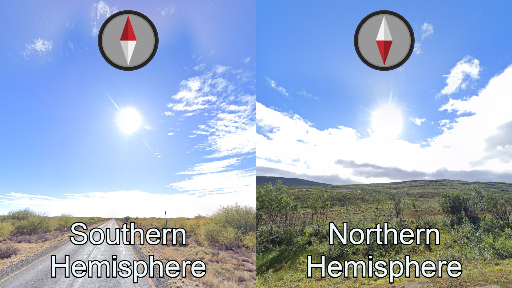
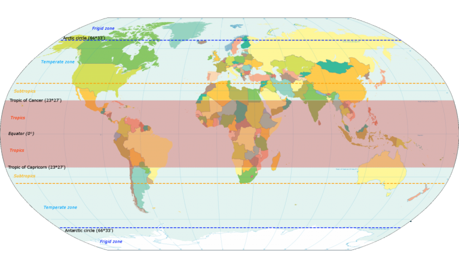
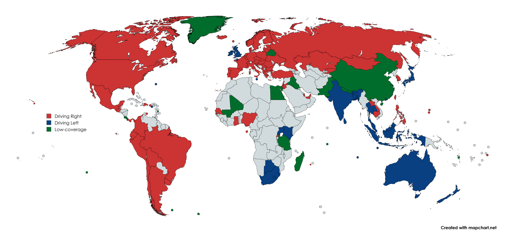

## 0. Coverage

การใช้ Google Street View เป็นฐานสำหรับเกมหมายความว่าสถานที่ที่พบในเกมจะมีข้อมูลเกี่ยวกับเวลาและวิธีการที่ภาพเหล่านั้นถูกถ่าย เคล็ดลับในส่วนนี้เป็นสิ่งที่ยากที่สุดในการเข้าใจ เนื่องจากไม่ใช่สิ่งที่คุณจะพบหากคุณเดินทางไปยังประเทศนั้นๆ เอง ผู้เล่นบางคนอาจชอบหลีกเลี่ยงเบาะแสประเภทนี้ให้มากที่สุด แต่ความจริงคือบางเบาะแสนั้นมีประโยชน์มาก

### คุณภาพของกล้องรุ่นต่างๆ

Google ได้ปล่อยภาพด้วยกล้อง 4 ประเภทหลักที่มีคุณภาพภาพที่แตกต่างกัน ซึ่งชุมชนเรียกว่ารุ่นของกล้อง (มักจะย่อว่า Gen 1/2/3/4)

 - Generation 1: ความละเอียดต่ำมาก ไม่ใช้ในแผนที่ส่วนใหญ่
 - Generation 2: เบลอเป็นวงกลมกว้างทั้งด้านล่างและท้องฟ้า ความละเอียดค่อนข้างต่ำ
 - Generation 3: ความละเอียดดีขึ้น แต่สีไม่อิ่มตัว ภาพหม่นๆ
 - Generation 4: ความละเอียดสูงสุด สีสันสดใส ภาพอิ่มตัวเล็กน้อย

นอกจากนี้ยังมีกล้องอีกตัวหนึ่งที่ใช้โดย Google เป็นกล้องราคาต่ำที่ใช้ในไม่กี่ประเทศ ชุมชนเรียกว่า "shitcam" เนื่องจากคุณภาพต่ำ แม้ว่าจะเป็นเช่นนี้ "shitcam" ก็ยังคงถูกปล่อยออกมาในปี 2024 กล้องนี้สามารถระบุได้จากความละเอียดต่ำและการเบลอเป็นวงกลมกว้างที่ครอบคลุมรถ

กล้องนี้เป็นกล้องเดียวที่ใช้ในอินเดีย และสามารถพบได้ทั่วไปในประเทศเช่น ไนจีเรีย กัมพูชา เลบานอน และเอกวาดอร์

การรู้จักรุ่นของกล้องที่มีอยู่ในแต่ละประเทศสามารถเป็นเครื่องมือที่มีพลังมากในการจำกัดรายชื่อประเทศที่เป็นไปได้

### ภาพมุมต่ำ

ในบางประเทศ เนื่องจากความกังวลเรื่องความเป็นส่วนตัว กล้องจะติดตั้งอยู่ที่ต่ำลงบนรถ ทำให้มุมมองภาพต่ำลงและสามารถรับรู้ได้ง่าย นี่หมายความว่าสิ่งของที่อยู่ใกล้พื้นดินจะดูสูงขึ้น และการเบลอบนรถ Google จะใหญ่กว่าปกติ ประเทศที่ใช้กล้องนี้อย่างเดียวคือ สวิตเซอร์แลนด์ และ ญี่ปุ่น ส่วนศรีลังกาใช้การติดตั้งกล้องนี้ในความครอบคลุม Generation 4

บางครั้งคนอาจเข้าใจผิดว่าการเบลอเป็นวงกลมใหญ่จากความครอบคลุม Generation 2 คือ lowcam เพื่อหลีกเลี่ยงความผิดพลาดนี้ คุณควรพยายามยืนยันว่าคุณมีมุมมองที่ต่ำกว่าปกติจริงๆ ความครอบคลุม Generation 2 ยังมีการเบลอด้านบนเป็นวงกลมที่คุณจะไม่พบใน lowcam อีกวิธีหนึ่งที่มักเข้าใจผิดระหว่าง lowcam กับกล้องปกติคือเมื่อรอบอยู่บนถนนที่มีความชันสูง กล้องปกติอาจดูเหมือน lowcam เมื่อมองขึ้นเนินและ lowcam อาจดูเหมือนกล้องปกติเมื่อมองลงเนิน

สุดท้าย ประเทศที่ใช้รถบรรทุกขนาดใหญ่ในการถ่ายภาพจะมีกล้องที่ติดตั้งต่ำกว่าปกติในทางเทคนิค แต่สามารถแยกแยะได้ง่ายจากรถ Google (หัวข้อนี้จะถูกพูดถึงในส่วนถัดไป) และการครอบคลุมนี้ไม่ถูกเรียกว่า lowcam โดยชุมชน

### ฤดูกาลในการถ่าย

บางครั้ง ภูมิภาคหรือประเทศเฉพาะได้รับการครอบคลุมทั้งหมดหรือส่วนใหญ่ในช่วงฤดูเดียว ซึ่งสามารถทำให้สถานที่นั้นมีลักษณะเฉพาะตามฤดูกาลได้ เช่นเดียวกับเบาะแสทั้งหมดที่กล่าวถึงในส่วน "meta" นี่เป็นเรื่องที่พบได้บ่อยในประเทศที่มีการครอบคลุมต่ำมากๆ แม้ว่าจะไม่ตั้งใจใส่ใจกับฤดูกาล ประเทศเหล่านี้ก็จะมีลักษณะเฉพาะที่กำหนดโดยฤดูกาล ซึ่งทำให้เป็นการครอบคลุม meta ที่หลีกเลี่ยงไม่ได้

ตามที่เห็นในตัวอย่างข้างต้น meta ของฤดูกาลในประเทศที่ครอบคลุมดีมักจะเชื่อมโยงกับรุ่นของกล้องและ/หรือ meta ของรถ วิธีการเดาภูมิภาคแบบนี้ไม่แนะนำสำหรับผู้เล่นระดับเริ่มต้นและระดับกลาง และมักจะใช้โดยผู้เล่นระดับสูงและผู้เล่นที่เชี่ยวชาญในประเทศเดียว

สิ่งสำคัญมากที่ต้องจำไว้คือฤดูกาลสามารถให้ลักษณะที่แตกต่างกันอย่างมากกับรอบของ Geoguessr ประเทศในภูมิอากาศเขตอบอุ่นที่มีสี่ฤดูที่แตกต่างกันอาจดูหม่นหมองในฤดูหนาวและสดใสในฤดูใบไม้ผลิและฤดูร้อน ในทำนองเดียวกัน ประเทศเขตร้อนอาจดูแตกต่างอย่างมากระหว่างฤดูแล้งและฤดูฝน

## 1. เบาะแสทั่วๆ ไป

### 1.1 ดวงอาทิตย์

จากหลักการของการเคลื่อนที่ของโลกและดวงอาทิตย์ เราจะสามารถเห็นดวงอาทิตย์เคลื่อนที่บนท้องฟ้าจากทิศตะวันออกไปยังทิศตะวันตกเสมอ แต่ดวงอาทิตย์ก็ไม่ได้เคลื่อนผ่านกลางหัวเราเป๊ะๆ หรือตรงเส้นศูนย์สูตรนะ โดยในแต่ละช่วงเวลา ฤดูกาลและสถานที่บนโลก เราจะเห็นดวงอาทิตย์อยู่เยื้องๆ ไปทางทิศเหนือหรือทิศใต้ ซึ่งถ้าเรารู้ว่าดวงอาทิตย์อยู่ทางทิศไหน เราก็จะสามารถตัดไปได้ครึ่งซีกโลก! 😲

โดยหลักๆ แล้ว มีวิธีการสังเกตก็คือ
- ถ้าดวงอาทิตย์อยู่ทางทิศใต้ แสดงว่าเราอยู่ซีกโลกเหนือ
- ถ้าดวงอาทิตย์อยู่ทางทิศเหนือ แสดงว่าเราอยู่ซีกโลกใต้

แต่!! ก็ไม่ได้เป็นแบบนี้เสมอไป สิ่งที่ต้องระวังในการสังเกตก็คือช่วงเวลาตอนเช้าๆ และเย็นๆ เพราะเวลาที่ดวงอาทิตย์ขึ้นและตก อาจจะเยื้องไปในทิศตรงกันข้ามแล้วก็ได้เหมือนกัน เพราะฉะนั้นถ้าดวงอาทิตย์เยื้องไปทางทิศตะวันออกหรือตะวันตกมากเกินไป ให้ไปสังเกตอย่างอื่นแทนเลยดีกว่า แต่ถ้าดวงทิตย์อยู่ช่วง NW - N - NE หรือ SW - S - SE เราก็สามารถนำเบาะแสตรงนี้มาใช้ได้

อีกอย่างหนึ่งที่ต้องระวังคือโซนเขตร้อน หรือบริเวณใต้เส้นรุ้งเขตร้อนเหนือ (Tropic of Cancer) และเหนือเส้นรุ้งเขตร้อนใต้ (Tropic of Capricorn) เพราะในฤดูร้อนดวงอาทิตย์จะอยู่ทิศเหนือในซีกโลกเหนือและอยู่ทิศใต้ในซีกโลกใต้ เพราะการเอียงของแกนโลกจะกดให้โลกรับแสงจากดวงอาทิตย์ในมุมที่สูงขึ้นหรือต่ำลงได้

แม้ทิศของดวงอาทิตย์จะมีความน่าเชื่อถือค่อนข้างต่ำ แต่ก็เป็นประโยชน์กับการเล่นแบบ No MPZ มากๆ หรือเอาไว้ช่วยยืนยันประกอบกับเบาะแสอื่นๆ ได้

### 1.2 เลนการขับรถ

ร้อยละ 90 ของเกมเราจะได้เจอถนนอยู่เสมอๆ ยกเว้นจะเจอแจคพอตจริงๆ การระบุฝั่งถนนที่รถขับก็สามารถช่วยตัดตัวเลือกประเทศไปได้มากมาย โดยสิ่งที่จะบอกใบ้เราว่ารถขับเลนไหนก็มีอยู่ด้วยกัน 4 อย่างคือ

1. **ป้ายจราจร**: มักจะติดตั้งในฝั่งเดียวกับที่รถขับ
2. **พวงมาลัย**: พวงมาลัยจะอยู่ฝั่งที่ใกล้กับกลางถนน ดังนั้นมันจะอยู่ทิศทางตรงกันข้ามกับเลนการขับรถเสมอ
3. **รถ Google**: บางครั้งเราอาจเห็นส่วนของรถ Google เช่น เสาอากาศที่อยู่ด้านหลัง
4. **ร่องรอยบนถนน**: เราอาจเห็นร่องรอยของฝุ่นที่เกิดจากรถ ซึ่งก็เดาได้ว่ามันคือท้ายรถ

โดยแต่ละเลนจะมีประเทศดังนี้

| เลนการขับรถ | ประเทศ                                                                                            |
| ---------- | ------------------------------------------------------------------------------------------------- |
| เลนขวา     | ทั้งทวีปอเมริกายกเว้นเบอร์มิวด้า, ทั้งยุโรปยกเว้นสหราชอาณาจักร และมอลตา, ลาว, กัมพูชา, ฟิลิปปินส์                    |
| เลนซ้าย     | สหราชอาณาจักร, แอฟริกาใต้, Botswana, Eswatini,Lesotho, Uganda, Kenya, เอเชียยกเว้นลาว, กัมพูชา, มองโกเลีย |

ก็เลือกจำแค่เลนเดียวก็พอ เพราะอีกครึ่งก็อยู่ตรงกันข้ามอยู่แล้ว ถ้าจะจำก็จำเลนขวาเลย เพราะน่าจะจำง่ายที่สุด

### 1.3 ภาษา

อีกหนึ่งในสิ่งที่เราจะได้พบเห็นกันบ่อยๆ ก็คือภาษา โดยเฉพาะในตัวเมือง ในบางประเทศจะมีตัวอักษรที่เป็นเอกลักษณ์ไม่เหมือนใครโดยเฉพาะในเอเชียของเรา หรือบางประเทศก็จะมีอักขระพิเศษที่บอกได้เลยว่าเป็นประเทศอะไร ทำให้เราระบุตำแหน่งได้เร็วขึ้น ถ้าจำได้ก็จะได้เปรียบสุดๆ

| อักษรพิเศษ                                            | จุดสังเกตและแยกแยะ          | ประเทศ                             |
| --------------------------------------------------- | ------------------------- | ---------------------------------- |
| ไม่มีอักษรพิเศษ                                         | ภาษาอังกฤษล้วน              | สหรัฐอเมริกา (USA)                   |
| ใช้ภาษาฝรั่งเศสและภาษาอังกฤษ                            | มีฝรั่งเศสและภาษาอังกฤษ       | แคนาดา (Canada)                    |
| é, è, ê, ë, à, â, î, ï, ô, û, ç                     | ç (çédille)               | France                             |
| ä, ö, ü, ß                                          | ß (eszett)                | Germany                            |
| ñ, á, é, í, ó, ú, ü                                 | ñ (eñe)                   | Spain, Argentina, Latin America    |
| ã, õ, â, ê, î, ô, û, ç                              | ã (tilde) และ ç (cedilha) | Portugal, Brazil                   |
| æ, ø, å                                             | å (å)                     | นอร์เวย์ (Norway), เดนมาร์ก (Denmark) |
| ä, ö                                                |                           | ฟินแลนด์ (Finland)                   |
| å, ä, ö                                             | å (å)                     | สวีเดน (Sweden)                     |
| ð, þ, æ, ö                                          | ð (eth) และ þ (thorn)     | ไอซ์แลนด์ (Iceland)                  |
| 汉字 (ตัวอักษรจีน)                                     |                           | จีน (China)                         |
| ひらがな (ฮิรางานะ), カタカナ (คาตาคานะ), 漢字 (คันจิ) |                           | ญี่ปุ่น (Japan)                        |
| 한글 (ฮันกึล)                                         |                           | เกาหลี (South Korea)                |
| อักษรไทยทั้งหมด                                        |                           | ไทย (Thailand)                     |
| देवनागरी (เทวนาครี)                                     |                           | อินเดีย (India)                      |
| Кириллица (ซีริลลิก)                                   |                           | รัสเซีย (Russia)                     |
| Ελληνικό αλφάβητο (อักษรกรีก)                         |                           | กรีซ (Greece)                       |
| อังกฤษ, แอฟริคานส์ (Afrikaans), และภาษาท้องถิ่น           |                           | แอฟริกาใต้ (South Africa)            |

นอกจากนี้ เรายังสามารถใช้ในการเดาแถบภูมิภาค (regionguess) ได้อีกด้วย เช่น ที่อินเดียมีระบบการเขียนที่แตกต่างกันในแต่ละภูมิภาค การเปรียบเทียบสัญลักษณ์จากข้อความกับชื่อสถานที่ในแผนที่ก็สามารถที่จะเดาแถบภูมิภาคของอินเดียได้

บางประเทศไม่มีภาษาของตัวเอง เช่น สวิตเซอร์แลนด์ ซึ่งมีภูมิภาคที่พูดภาษาฝรั่งเศส เยอรมัน และอิตาลี ส่วนในประเทศอื่นๆ เช่น สเปน ก็มีภาษาท้องถิ่นที่เป็นเอกลักษณ์ของแต่ละภูมิภาค

### 1.4 ธงชาติ และ domain name

การรู้จักธงและโดเมนของทุกประเทศก็ช่วยเป็นเบาะแสได้เป็นอย่างดี (ถ้าจำได้) แต่ควรระวังว่าธงบางประเทศอาจคล้ายกันและโดเมนบางประเทศอาจไม่ตรงตามที่คาด และการพึ่งพาสิ่งเหล่านี้มากเกินไปอาจขัดขวางการเรียนรู้และประสบการณ์การเล่นเกม

## สถาปัตยกรรม

เป็นเบาะแสที่ดีอย่างหนึ่งที่แม้จะมีความไม่แน่นอนอยู่บ้าง เพราะสมัยนี้คนก็อาจสร้างบ้านในสไตล์ของประเทศอื่นด้วยเหตุผลต่างๆ แต่การดูรายละเอียดของตัวอาคาร และการรู้จักอาคารหรือเทคนิคการก่อสร้างที่เป็นเอกลักษณ์ หรือสถาปัตยกรรมแบบดั้งเดิมของประเทศนั้น ก็สามารถช่วยให้เราเดาได้ใกล้เคียงมากขึ้น

## สภาพภูมิประเทศ

เป็นเรื่องปกติที่เราจะรู้สึกว่าป่าและภูเขาทั่วโลกดูเหมือนกันไปหมด แต่พอเล่นไปเรื่อยๆ เราก็จะสามารถบอกความแตกต่างของภูมิทัศน์รอบๆ ตัวได้ ของแบบนี้ต้องการประสบการณ์เข้ามาช่วย

## พืชพรรณและพืชผล

ในแถบชนบทของหลายๆ ประเทศ ก็แทบจะไม่มีเบาะแสทางถนนหรือวัตถุใดๆ จากฝีมือมนุษย์ให้สังเกตได้เลย จะมีก็ป่าข้างทาง และพืชผลตามรายทาง ซึ่งเราสามารถแยกแยะป่าเขตร้อนกับป่าฝนได้ และหากรู้ขอบเขตและลักษณะสำคัญของชนิดพืชที่มีเฉพาะบริเวญนั้นๆ ก็จะเป็นเบาะแสที่ช่วยระบุทวีป และภูมิภาคได้

## ลักษณะทางธรณีวิทยา

บางประเทศยังมีถนนดินลูกรังมาก สีของดินก็เป็นเบาะแสอย่างดีในการระบุบริเวณ แต่นี่เป็นอีกสิ่งที่ต้องใช้ประสบการณ์ในการเล่นเพราะดินก็มีลักษณะเฉพาะที่แม้ง่ายต่อการจดจำ แต่ยากที่จะอธิบาย

ภูมิประเทศของประเทศเป็นเคล็ดลับพื้นฐานในการระบุรอบอย่างถูกต้อง การเรียนรู้ว่าประเทศใดมีภูเขาสูงที่สุดหรือที่ราบแบนมากที่สุดนั้นไม่ยาก

## Infrastructure

### เสาหลักข้างทาง Bollards

เสาหลักข้างทาง (bollards) เป็นเครื่องหมายความปลอดภัยขนาดเล็กที่วางอยู่ข้างถนน เสาหลักข้างทางและเครื่องหมายอื่นๆ เช่น เสาหิมะ เป็นเบาะแสที่ดีมากในการระบุประเทศ เนื่องจากประเทศที่ใช้เครื่องหมายเหล่านี้มักมีการออกแบบที่เป็นเอกลักษณ์ การพยายามจดจำเสาหลักที่เด่นที่สุดที่คุณเห็นในเกมเป็นขั้นตอนแรกที่ดีในการระบุประเทศได้อย่างสม่ำเสมอ

รายละเอียดที่สำคัญมากเกี่ยวกับเสาหลัก โดยเฉพาะในยุโรป คือรูปร่างและสีของแผ่นสะท้อนแสง เสาหลักที่มีลักษณะคล้ายกันในเบื้องต้นสามารถแยกแยะได้จากแผ่นสะท้อนแสงของพวกเขา ตัวอย่างเช่น สเปนและเยอรมนีทั้งคู่มีเสาหลักสีขาวรูปทรงลิ่มที่มีแผ่นสะท้อนแสงสี่เหลี่ยมผืนผ้ายาวอยู่ด้านหน้าและแผ่นสะท้อนแสงวงกลมสองอันอยู่ด้านหลัง ความแตกต่างที่สำคัญคือแผ่นสะท้อนแสงด้านหน้าของสเปนเป็นสีเหลือง

### เส้นถนน

เนื่องจากตำแหน่งส่วนใหญ่ใน Street View อยู่บนถนนลาดยาง สีและรูปร่างของเส้นแบ่งถนน รวมถึงวัสดุและคุณภาพของถนน เป็นเบาะแสที่มีความสม่ำเสมอมากในการจำกัดตำแหน่งให้เหลือเพียงไม่กี่ประเทศ เส้นแบ่งถนนเพียงอย่างเดียวมักจะไม่สามารถกำหนดประเทศได้ แต่เมื่อรวมกับเบาะแสอื่น ๆ มันกลายเป็นสิ่งที่น่าเชื่อถือที่สุดที่ใช้ในเกมของคุณ

คุณภาพและวัสดุของถนนยังสามารถเป็นวิธีการเดาตำแหน่งได้ด้วย แม้ว่าอาจจะไม่สม่ำเสมอเท่า แต่ก็สามารถเป็นเบาะแสที่แข็งแกร่งมากสำหรับบางประเทศและภูมิภาค ตัวอย่างเช่น มีเพียงไม่กี่ประเทศที่ใช้ถนนคอนกรีตอย่างแพร่หลาย และถนนที่ไม่ได้รับการดูแลอย่างดีมีมากกว่าในบางประเทศเมื่อเทียบกับประเทศอื่น ๆ

### ป้ายจราจร

ป้ายจราจรมีคุณลักษณะเฉพาะมากมายที่ผู้เล่นใช้ในการระบุประเทศ เบาะแสบางอย่างอาจเห็นได้ชัดเจน เช่น ป้ายหยุดที่มีลักษณะเด่น ในขณะที่บางอย่างอาจละเอียดอ่อนกว่า เช่น ความหนาของขอบสีแดงในป้ายจราจรหรือแบบอักษรที่ใช้ในป้ายจำกัดความเร็ว

ป้ายที่เกี่ยวข้องกับถนนอื่นๆ เช่น ป้ายบอกระยะทางเป็นกิโลเมตร/ไมล์ก็อาจมีลักษณะเฉพาะของประเทศหรือกลุ่มประเทศได้เช่นกัน

ในขณะที่ส่วนใหญ่เวลาที่คุณเห็นป้ายบอกทิศทาง คุณสามารถใช้ชื่อสถานที่ในการอนุมานว่าคุณอยู่ในประเทศใด การรู้จักการออกแบบที่ใช้ในประเทศต่างๆ ก็สามารถเป็นเบาะแสที่แข็งแกร่งได้เมื่อคุณเล่นแบบ No Move หรือ NMPZ (No Move, Pan, or Zoom)

### ป้ายถนน

ป้ายถนนเป็นเบาะแสที่มีประโยชน์มากในรอบที่อยู่ในเขตเมือง แน่นอนว่ามันช่วยในการระบุจุดที่แน่นอนในรอบนั้นได้ แต่ยังสามารถใช้ในการรู้ประเทศหรือเมืองในรูปแบบที่ไม่จำเป็นต้องเจาะจงตำแหน่งที่แน่นอน (ไม่จำเป็นต้อง 5k) ตัวอย่างเช่น หลายภาษามีคำเฉพาะสำหรับ "ถนน" และบางเมืองใหญ่มีป้ายถนนที่มีลักษณะเฉพาะที่ผู้เล่นได้เรียนรู้ที่จะแยกแยะ

บางเมืองใหญ่มีการจัดระเบียบเป็นเขตหรือรูปแบบการแบ่งย่อยอื่นๆ ที่คุณสามารถพบในป้ายถนน ในบางประเทศเช่น เม็กซิโกหรือบราซิล เป็นเรื่องปกติที่จะเห็นรหัสไปรษณีย์บนป้ายถนน ซึ่งสามารถใช้ในการเดาภูมิภาคได้

### เสาไฟฟ้า

สายไฟฟ้าและสายสาธารณูปโภคสามารถพบได้ข้างถนนในทั้งเขตเมืองและชนบท ทำให้เป็นเครื่องมือที่มีประสิทธิภาพมากในการใช้ระบุสถานที่ วัสดุของเสา (ไม้, คอนกรีต, โลหะ, ฯลฯ), รูปร่างของเสา หรือยอดเสาที่รองรับสายไฟ รวมถึงเครื่องหมายต่างๆ บนเสา ล้วนเป็นปัจจัยที่ช่วยในการระบุสถานที่ได้

### ป้ายทะเบียนรถ

รถยนต์และยานพาหนะอื่น ๆ มักจะมีป้ายทะเบียน ซึ่งสี รูปร่าง การมีหรือไม่มีป้ายด้านหน้า หรือเครื่องหมายที่มีสีสันเป็นพิเศษ สามารถใช้ในการระบุประเทศได้

## Street View

| ทวีป                        | ประเทศ                           | domain name | ปีที่เข้า       |
| :------------------------- | :------------------------------- | :---------- | :---------- |
| อเมริกาเหนือ (North America) | สหรัฐอเมริกา (USA)                 |             |             |
|                            | แคนาดา (Canada)                  |             |             |
|                            | (Puerto Rico)                    |             |             |
|                            | (The Dominican Republic)         |             |             |
|                            | เม็กซิโก (Mexico)                  |             |             |
|                            | กัวเตมาลา (Guatemala)             |             |             |
|                            | (US Virgin Islands)              |             |             |
|                            | เบอร์มิวดา (Bermuda)               |             |             |
|                            | (Panama)                         |             |             |
|                            |                                  |             |             |
| อเมริกาใต้ (South America)   | Brazil                           |             |             |
|                            | Argentina                        |             |             |
|                            | Uruguay                          |             |             |
|                            | Ecuador                          |             |             |
|                            | Colombia                         |             |             |
|                            | Peru                             |             |             |
|                            | Bolivia                          |             |             |
|                            | Chile                            |             |             |
|                            | Curacao                          |             |             |
|                            |                                  |             |             |
| ยุโรป (Europe)              |                                  |             |             |
|                            | 🇯🇪 เจอร์ซีย์ (Jersey)                | .je         | Gen 2       |
|                            | 🇮🇪 ไอร์แลนด์ (Ireland)              | .le         | Gen 2, 3, 4 |
|                            | 🇮🇲 ไอล์ออฟแมน (The Isle of Man)    | .im         | Gen 2       |
|                            | 🇬🇧 สหราชอาณาจักร (The U.K.)        | .uk         | Gen 2, 3, 4 |
|                            | Spain                            |   .es          | Gen 2, 3, 4            |
|                            | (The Canary Islands)             |             |             |
|                            | Andorra                          |             |             |
|                            | (Gibraltar)                      |             |             |
|                            | France                           |             |             |
|                            | Belgium                          |             |             |
|                            | The Netherlands                  |             |             |
|                            | Luxembourg                       |             |             |
|                            | Italy                            |             |             |
|                            | San Marino                       |             |             |
|                            | นอร์เวย์ (Norway)                  |             |             |
|                            | (Svalbard)                       |             |             |
|                            | 🇸🇪 สวีเดน (Sweden)                 |             |             |
|                            | 🇫🇮 ฟินแลนด์ (Finland)               |             |             |
|                            | 🇩🇰 เดนมาร์ก (Denmark)              |             |             |
|                            | 🇫🇴 หมู่เกาะแฟโร (The Faroe Islands) | .fo         | Gen 3       |
|                            | 🇮🇸 ไอซ์แลนด์ (Iceland)              | .is         | Gen 3       |
|                            | Greenland                        |             |             |
|                            | Germany                          |             |             |
|                            | Austria                          |             |             |
|                            | Switzerland                      |             |             |
|                            | Poland                           |             |
|                            | 🇵🇹 โปรตุเกส (Portugal)             | .pt         | Gen 2, 3, 4 |
|                            | Lithuania                        |             |
|                            | Latvia                           |             |
|                            | Estonia                          |             |
|                            | Czechia                          |             |
|                            | Slovakia                         |             |
|                            | Slovenia                         |             |
|                            | Hungary                          |             |
|                            | Croatia                          |             |
|                            | Albania                          |             |
|                            | Greece                           |             |
|                            | Romania                          |             |
|                            | Montenegro                       |             |
|                            | Serbia                           |             |
|                            | North Macedonia                  |             |
|                            | Bulgaria                         |             |
|                            | Ukraine                          |             |
|                            | Russia                           |             |
|                            | Malta                            |             |
|                            |                                  |             |
| Africa                     | South Africa                     |             |
|                            | Botswana                         |             |
|                            | Eswatini                         |             |
|                            | Lesotho                          |             |
|                            | Uganda                           |             |
|                            | Kenya                            |             |
|                            | Rwanda                           |             |
|                            | Ghana                            |             |
|                            | Nigeria                          |             |
|                            | Senegal                          |             |
|                            | Tunisia                          |             |
|                            | Reunion                          |             |
|                            | Madagascar                       |             |
|                            | Sao Tome and Principe            |             |
|                            |                                  |             |
| Asia                       | Bhutan                           |             |
|                            | Hong Kong                        |             |
|                            | (Macau)                          |             |
|                            | Japan                            |             |
|                            | Cambodia                         |             |
|                            | ไทย (Thailand)                   | .th         |             |
|                            | Taiwan                           |             |
|                            | South Korea                      |             |
|                            | The United Arab Emirates         |             |
|                            | Jordan                           |             |
|                            | Qatar                            |             |
|                            | Israel                           |             |
|                            | Palestine                        |             |
|                            | (Lebanon)                        |             |
|                            | Kyrgyzstan                       |             |
|                            | Mongolia                         |             |
|                            | Kazakhstan                       |             |
|                            | Indonesia                        |             |
|                            | Malaysia                         |             |
|                            | Vietnam                          |             |
|                            | Laos                             |             |
|                            | The Philippines                  |             |
|                            | Sri Lanka                        |             |
|                            | Bangladesh                       |             |
|                            | India                            |             |
|                            | Pakistan                         |             |
|                            | Singapore                        |             |
|                            | Turkey                           |             |
|                            |                                  |             |
| Oceania                    | Australia                        |             |
|                            | New Zealand                      |             |
|                            | American Samoa                   |             |
|                            | Northern Mariana Islands         |             |
|                            | Guam                             |             |
|                            | Midway Atoll                     |             |
|                            | (Christmas Island)               |             |
|                            |                                  |             |

## เคล็ดลับในการเล่น GeoGuessr

### 1. ดูป้ายถนนและภาษา

ป้ายถนนสามารถบอกได้มากมายเกี่ยวกับทวีป หรือประเทศที่เราอยู่ เช่น ภาษาที่ใช้หรือรูปแบบของป้าย

ป้ายเตือน

|                                  |                        |
| -------------------------------- | ---------------------- |
| สี่เหลี่ยม พื้นเหลือง                   | ทวีปอเมริกา ฟิลิปิน         |
| สามเหลี่ยม พื้นขาว ขอบแดง            | ทวีปยุโรป แอฟริกา         |
| สามเหลี่ยม พื้นขาว ขอบแดง ไม่มีกรอบขาว | สเปน                   |
| สามเหลี่ยม พื้นเหลือง ขอบแดง          | สวีเดน นอเว ไอแลน เกาหลี |
| สามเหลี่ยม พื้นเหลือง ขอบแดงบาง       | โปแลน                  |

### 2. สังเกตสภาพแวดล้อม

การสังเกตสภาพแวดล้อมเป็นหนึ่งในวิธีที่มีประสิทธิภาพในการระบุทวีปหรือประเทศในเกม GeoGuessr นี่คือข้อมูลและเคล็ดลับเพื่อช่วยให้เราทำได้แม่นยำมากขึ้น:

| ถนน      | เครื่องหมายจราจร     | สถาปัตยกรรม                         | ภูมิประเทศ         | ทวีป                  |
| -------- | ------------------ | ---------------------------------- | ---------------- | -------------------- |
| มักจะเรียบ | สีฟ้าหรือสีขาว         | โกธิคและบาโรก                       | ป่าเขียวชอุ่ม        | ยุโรปกลาง             |
|          |                    |                                    | ทุ่งหญ้าและภูเขา     | ยุโรปตะวันตกและตอนเหนือ |
| ใหญ่ กว้าง | สีเขียวและสีขาว       | บ้านแบบไม้ในชนบท และอาคารสูงในเมืองใหญ่ | ป่าสนและภูเขาหิน    | แคนาดา               |
|          |                    |                                    | ทะเลทรายและทุ่งหญ้า | สหรัฐอเมริกา           |
| ไม่เรียบ   | ภาษาสเปนหรือโปรตุเกส | โคโลเนียล, สีสันสดใสและบ้านแบบง่ายๆ     | ป่าฝนเขตร้อน       | อเมซอน               |

### 3. ดูรถยนต์และป้ายทะเบียน

#### เส้นถนน

| เส้นไหล่ทาง | เส้นกลางถนน   | ประเทศ                                |
| --------- | ------------ | ------------------------------------- |
| ขาว       | เหลือง        | ไทย, เกือบทั้งทวีปอเมริกา, นอร์เวย์ (Norway) |
| ขาว       | เหลือง หรือขาว | อาเจนตินา      ฟิลิปิน                    |
| ขาว       | ขาว          | ชิลี, เกือบทั้งยุโรป                        |
| ขาว       | เหลือง และขาว | อุรุกวัย                                 |
| เหลืองคู่    | ขาว          | สหราชอาณาจักร                          |
| เหลืองประ  | ขาว          | ไอซ์แลนด์ (Iceland)                     |

#### ป้ายทะเบียนรถ

| ป้าย                    | ประเทศ                |
| ---------------------- | --------------------- |
| หน้าขาว หลังเหลือง        | สหราชอาณาจักร          |
| หลังเหลือง               | เนเธอร์แลนด์            |
| ขาวมีแถบสีฟ้าด้านซ้าย       | เยอรมนี, ฝรั่งเศส, สวีเดน |
| ขาวมีแถบสีฟ้าด้านซ้ายและขวา | อิตาลี                  |

#### ลักษณะรถยนต์

| ป้าย                   | ประเทศ                 |
| --------------------- | ---------------------- |
| รถยนต์ขนาดเล็กและคอมแพ็ค | ญี่ปุ่นและยุโรป             |
| รถกระบะขนาดใหญ่        | สหรัฐอเมริกาและออสเตรเลีย |
| รถยนต์ SUVs            | แคนาดาและสหรัฐอเมริกา    |

### 4. สังเกตสถาปัตยกรรม

### ยุโรป (Europe)

ป้ายทะเบียนส่วนใหญ่ในยุโรปจะเป็นแผ่นเรียวยาวสีขาว และมีแถบสีน้ำเงินทางซ้าย
ถ้าเจอป้ายทะเบียนแบบนี้ยุโรป 99.99%

ป้ายจราจรจะเป็นพื้นเหลือง ขอบแดง

ต้นมะกอกในยุโรปจะปลูกแถบทะเลเมดิเตอร์เรเนียน (Spain, Italy, Greece and Portugal)

||

#### Ireland

#### Ireland

## Reference

[The Plonk It Guide to GeoGuessr](https://www.plonkit.net/guide)
[GeoTips](https://geotips.net/)
