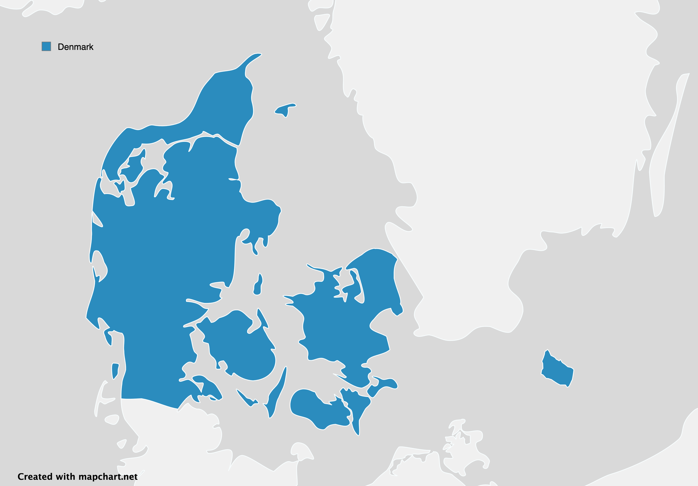
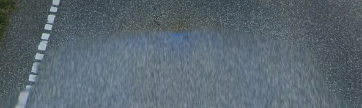
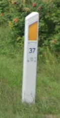
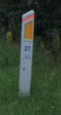
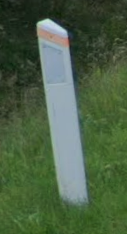
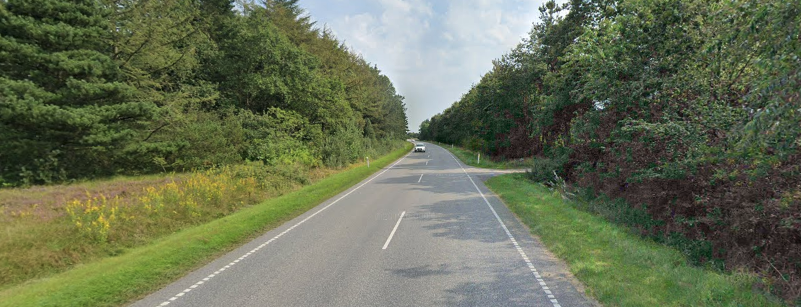
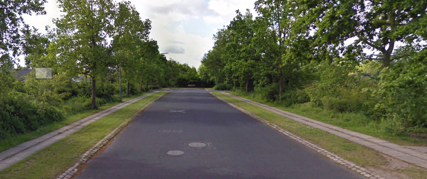
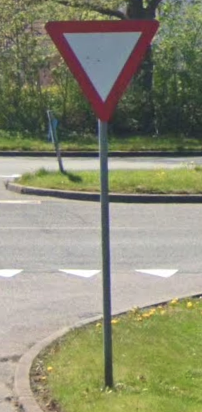

ประเทศในแถบ Nordic หรือยุโรปตอนเหนือ ดินแดนที่คนมีความสุขมากที่สุดในโลก มีเมืองที่เป็นมิตรกับสิ่งแวดล้อม ใกล้ชิดธรรมชาติ มักจะมีอะไรที่คล้ายๆ กัน มีด้วยกันอยู่ 5 ประเทศดังนี้

- Denmark
- Finland
- Iceland
- Norway
- Sweden

และ 3 ดินแดน

- Åland
- Faroe Islands
- Greenland

มาดูกันว่าเราจะรู้ได้ยังไงว่าสถานที่นั้นๆ คือประเทศแถบ Nordic และในแถบนี้จะรู้ได้ยังไงว่าเป็นประเทศไหน

## 0. Nordic Clues

## 1. 🇩🇰 เดนมาร์ก (Denmark)

ดินแดนของชาวไวกิ้งที่ปัจจุบันกลายเป็นหนึ่งในสังคมที่สงบสุขที่สุดในโลกแห่งหนึ่ง ตั้งอยู่ทางใต้สุดของประเทศแถบสแกนดิเนเวีย หรือประเทศ​ Nordic แบ่งพื้นที่ออกเป็นคือ คาบสมุทรจัตแลนด์ (Jutland), เกาะฟึน (Funen), เกาะเซลันด์ (Zealand) เกาะโลลแลนด์ (Lolland) และเกาะบอร์นโฮล์ม (Bornholm)

ข้อมูลทั่วไป
|                   |             |
| :---------------- | :---------- |
| ธงชาติ             | 🇩🇰           |
| ภาษา              | Danish      |
| เมืองหลวง          | København   |
| domain name       | .dk         |
| Camera Generation | Gen 2, 3, 4 |

| หัวเมืองหลัก              | ตำแหน่ง                                           |
| :--------------------- | :---------------------------------------------- |
| København (โคเปนเฮเกน) | ตะวันออกของเกาะเซลันด์ (Zealand)                   |
| Aarhus (ออร์ฮูส)         | ตะวันออกของคาบสมุทรจัตแลนด์ (Jutland)               |
| Odense (โอเดนเซ)       | ตอนกลางของเกาะฟึน (Funen)                        |
| Aalborg (ออลบอร์ก)      | ตอนเหนือของคาบสมุทรจัตแลนด์ (Jutland)               |
| Esbjerg (เอสเบียร์)      | ตะวันตกเฉียงใต้ของคาบสมุทรจัตแลนด์ (Jutland)          |
| Randers (แรนเดอร์ส)     | ตะวันออกของคาบสมุทรจัตแลนด์ (Jutland)               |
| Køge (โคเก)            | ตะวันตกเฉียงใต้ของโคเปนเฮเกน บนเกาะเซลันด์ (Zealand) |
| Herning (เฮอร์นิง)       | ตอนกลางของคาบสมุทรจัตแลนด์ (Jutland)               |
| Holstebro (โฮลสเตบรู)   | ตะวันตกของคาบสมุทรจัตแลนด์ (Jutland)                |
| Viborg (วีบอร์ก)         | ตอนกลางของคาบสมุทรจัตแลนด์ (Jutland)               |

### Google Car/Camera Generation

กล้อง Gen 3 จะมีเสา antenna สั้นๆ พบได้ไม่บ่อย

เกือบทั้งหมดของเดนมาร์กจะใช้กล้อง Gen 4 แล้ว ซึ่งสังเกตเห็นเป็นรถสีน้ำเงิน

### เสาหลักถนน (Bollard)

เสาแบบนี้จะพบได้ทั่วทั้งเดนมาร์ก แต่บางครั้งแถบสีส้มๆ ด้านบนก็อาจจะหลุดหายไป

### ถนน (Road)

ถนนในแถบชนบทเล้นจะจางๆ มักจะเหลือสีเส้นกลางถนน

เส้นไหล่ทางและเส้นกลางถนนจะมีสีขาวทั้งหมด เหมือนกับของทางยุโรปส่วนใหญ่
แต่เส้นไหล่ทางของเดนมาร์กส่วนใหญ่มักจะเป็นเส้นประที่เป็นสี่เหลี่ยมเล็กๆ ยาวไปทั่วทั้งถนนสายหลักของประเทศ

หรือบางครั้งก็จะเจอเส้นประสีขาวยาวที่ข้างถนน แต่มีช่องว่างเล็กๆ ระหว่างแต่ละเส้น

### ป้ายบอกทาง (Directional Signs)

ป้ายบอกทิศทางในเดนมาร์กมีลักษณะพิเศษคือใช้**พื้นหลังสีขาว**และ**ตัวอักษรสีแดง** นอกจากนี้ป้ายบอกชื่อถนนในเดนมาร์กก็มักจะเป็น**พื้นหลังสีน้ำเงิน**และ**ตัวอักษรสีขาว** และมีรูปแบบเดียวกันกับป้ายบอกทิศทาง

### ป้ายจราจร (Traffic Signs)

เดนมาร์กจะใช้ป้ายเหมือนกับประเทศส่วนใหญ่ในยุโรปคือ **ขอบหนาสีแดง**และ**พื้นสีขาว** ต่างจากประเทศแถบ Nordic ที่ใช้พื้นสีเหลืองกัน และอีกจุดสังเกตก็คือป้ายจะไม่มีขอบขาวๆครอบขอบสีแดงเลย

## เส้นทางด่วน (Highways)

จะมีด้วยกันอยู่ 2 แบบคือ
- พื้นเหลืองขอบดำ ตัวเลขทั้งหมด
- พื้นขาว ขอบดำ ตัวเลขทั้งหมด
