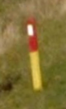
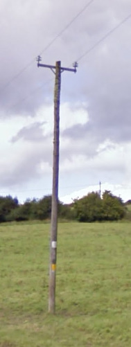
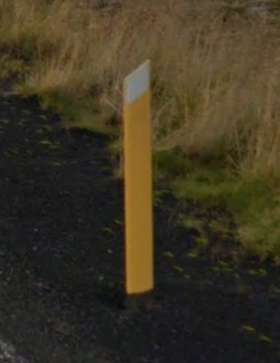
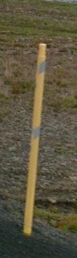
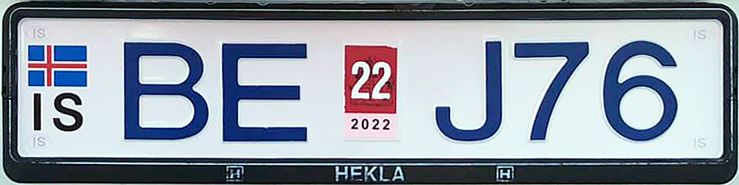
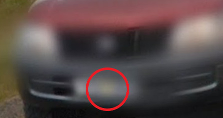

## Bollard

เสาหลักข้างทาง (bollards) เป็นแท่งเสาเล็กๆที่อยู่ข้างถนน เป็นเบาะแสที่ดีมากๆ ในการระบุประเทศ เพราะแต่ละประเทศมักมีการออกแบบที่เป็นเอกลักษณ์ ทำให้เราสามารถระบุประเทศได้ทันที

เสาไม้เล็กๆ ครึ่งล่างสีเหลือง ครึ่งบนสีแดง มีที่เดียวเลยคือ หมู่เกาะแฟโร (The Faroe Islands)

## Road Signs

## Electricity poles

### เสาไม้

## License plates

## 🇮🇪 ไอร์แลนด์ (Ireland)

วิธีที่ง่ายที่สุดในการแยกไอร์แลนด์ออกจากสหราชอาณาจักรคือการดูป้ายทะเบียน ไอร์แลนด์มีทั้งแผ่นหลังและแผ่นหน้าสีขาว ในขณะที่สหราชอาณาจักรมีแผ่นหลังสีเหลือง

เสา bollard ที่พบได้ทั่วไปในไอร์แลนด์ มีสีเหลือง และสีขาวสะท้อนแสงข้างบน

ไม่ได้ใช้ป้ายทะเบียนที่มีแถบน้ำเงินทางซ้ายแบบในยุโรป แต่จะมีสีเหลืองๆ เบลอๆ ตรงกลางจากสติ๊กเกอร์
